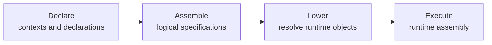

# Introduction

Boomerang is a Rust runtime and composition framework for deterministic
reactive systems. It is intended for robotics and embedded products whose
software must remain understandable and testable as it grows across teams,
cores, processes, and electronic control units (ECUs).

Applications are composed from typed reactors connected by actions and ports.
Logical time and an analyzed dependency graph give those components a
deterministic execution order. The long-term deployment model separates the
application graph from its placement, allowing the same graph to run as one
local system, as several local enclaves, or as a federation distributed across
multiple targets.

This separation supports an iterative workflow:

1. Develop and test reusable reactors independently.
2. Compose and validate the complete logical graph.
3. Run it locally with accelerated logical time in CI.
4. Apply the production partitioning and exercise it in memory on one host.
5. Deploy the same graph across the target cores and ECUs.
6. Record physical or deployment boundaries and replay selected subsystems for
   regression and integration testing.

## Assembly and Runtime Vocabulary

Boomerang separates declaring the logical application from executing it. Reactor
macros and manual APIs use a `ReactorContext` and `ReactionDeclaration` to record
typed specifications in an `Assembly`. Lowering resolves assembly keys and
deferred factories, producing a `RuntimeAssembly` whose enclaves can be executed
by the runtime or a federation runner:

See the [Glossary](./glossary.md) for definitions of these suffixes and the
related keys, placement, partition, and runtime concepts.

Boomerang is an early-stage project. Deterministic logical-time execution,
local enclaves, modal reactors, recording/replay foundations, and experimental
static federation exist today. Deployment-independent partitioning,
boundary-layer replay, production multi-ECU deployment, mixed-criticality
policies, and `no_std` support are project goals rather than current guarantees.
See [Project Goals and Status](./project-goals.md) for the detailed distinction.

## Origins

Boomerang is a Rust-first implementation of the Reactors deterministic actor
model described by M. Lohstroh, A. Lee, and others at UC Berkeley in
[Reactors: A Deterministic Model for Composable Reactive Systems](https://ptolemy.berkeley.edu/publications/papers/19/LohstrohEtAl_Reactors_DAC_2019.pdf).

[Lingua Franca](https://github.com/lf-lang/lingua-franca) is an important point
of reference. Boomerang began as a Rust port of its discrete-event scheduler,
but uses Rust types and macros for reactor behavior and composition instead of
a separate coordination language. See also
[Reactor C++](https://github.com/tud-ccc/reactor-cpp).
