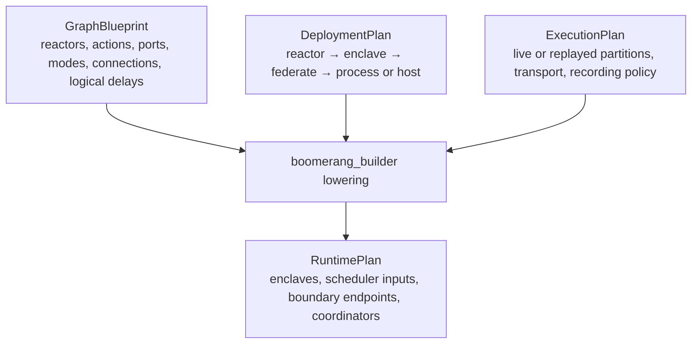
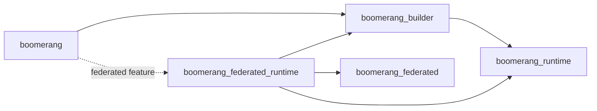
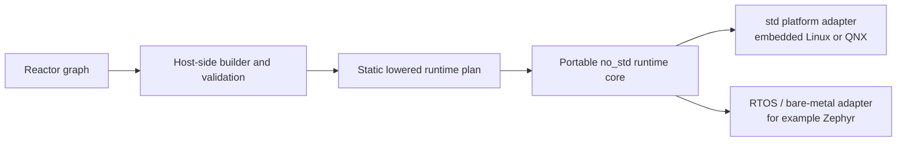

# Graph Partitioning, Federation, and Replay Architecture

This document defines the target architecture for composing, partitioning, and
executing Boomerang reactor graphs. It is normative design guidance, not a
description of the current implementation and not a migration plan.

## Goals

Users should describe application behavior once as a reactor graph and then
choose how that graph is deployed. The same graph must support:

- execution as one local enclave;
- execution as multiple local enclaves;
- execution as multiple federates connected in memory or over a transport;
- execution on one CI host using the production partitioning; and
- partial replay, including replacement of a federate or enclave with recorded
  boundary data.
- deployment through platform adapters on hosted embedded systems and,
  eventually, constrained `no_std` targets.

Changing deployment must not change the graph's deterministic logical
behavior. Given the same initial state and logical inputs, each supported
deployment should produce the same observable logical trace.

## Architectural Model

Graph composition, deployment, and execution policy are separate inputs to
lowering:

`GraphBlueprint` is a logical description. It does not embed enclave,
federate, process, host, or transport choices. It can be instantiated more than
once with fresh runtime state so that different deployments can execute the
same graph definition.

`DeploymentPlan` assigns graph regions to deployment boundaries. Enclaves and
federates are distinct concepts: reactors are assigned to enclaves, and one or
more enclaves may be assigned to a federate. Federates may then be assigned to
processes or hosts.

`ExecutionPlan` selects how the deployment is exercised. It can choose live or
replayed execution per partition, select an in-memory or network transport,
and enable recording or validation at selected boundaries.

`RuntimePlan` is the fully lowered, executable result. It contains runtime
keys and objects, but no unresolved builder identities or placement policy.

## Stable Logical Identity

Every addressable graph object must have a stable logical identity before
partitioning. Reactor, action, port, connection, and boundary endpoint
identities should derive from canonical graph paths or another persistent
graph identifier, not runtime allocation order.

Runtime keys such as enclave and action keys are lowering artifacts. They may
change when a graph is repartitioned and therefore must not be used as durable
recording identities, deployment selectors, or compatibility keys.

A recording should identify the graph and endpoint independently of its
deployment. At minimum, recorded boundary events carry:

- a stable logical endpoint identity;
- the complete logical tag, including offset and microstep;
- payload schema and encoding information;
- deterministic ordering information for events sharing a tag; and
- a graph or interface fingerprint suitable for compatibility checks.

## Partitioning and Boundary Lowering

Partitioning is a builder transformation over the complete logical graph. It
must not require application code to call different reactor-construction APIs
for local and federated deployments.

For every connection, lowering selects a delivery mechanism based on the
deployment and execution plans:

| Boundary | Lowered delivery |
| --- | --- |
| Within one enclave | Direct runtime connection |
| Between local enclaves | Runtime asynchronous endpoint |
| Between federates | Serialized federated endpoint |
| From a replayed partition | Trace-backed endpoint |

These mechanisms implement one logical delivery contract. The contract
preserves endpoint identity, payload value, logical delay, full tag, and
same-tag ordering. Transport and serialization are implementation details and
must not introduce observable logical behavior.

The builder owns all graph analysis and lowering. It validates partition
boundaries, derives endpoint identities, creates source and target bridge
reactions, resolves runtime aliases, and emits a protocol-neutral runtime
description. Protocol topology and wire types are not builder output.

## Deterministic Equivalence

Determinism is defined over the observable logical trace, normalized to stable
logical identities. A trace includes logical tags, endpoint or action
identities, and values relevant to the application's observable behavior.

Equivalent deployments must preserve:

- logical tag and microstep progression;
- connection delays and action scheduling semantics;
- deterministic ordering of events at the same tag;
- mode transitions and shutdown behavior; and
- the absence or presence semantics required by the supported topology.

Wall-clock timing, thread scheduling, transport latency, and runtime key values
are not part of logical equivalence. Physical inputs must be recorded,
virtualized, or otherwise controlled before deterministic comparison is
meaningful.

A single-enclave execution is the semantic reference path. Production
partitioning with in-memory transport should exercise the distributed control
path on one host. Comparing their normalized traces provides a deployment
equivalence test.

## Replay and Partition Substitution

Deterministic replay has two complementary recording layers. Physical-boundary
recording captures nondeterministic inputs entering the graph. Deployment-
boundary recording captures tagged traffic between enclaves or federates so an
entire partition can be substituted in CI.

Replay is an execution overlay, not a different reactor graph. The preferred
unit of subsystem substitution is a deployment boundary such as an enclave or
federate. Replacing a partition with replay performs three operations:

1. Do not execute the replaced partition's live reactors.
2. Inject its recorded outbound boundary events at their original full logical
   tags.
3. Optionally compare live inbound boundary events with the recording's
   expected inputs and fail on divergence.

Boundary replay avoids coupling recordings to the internal runtime layout of
the replaced partition. Internal action replay may still be supported, but it
uses the same stable logical identities and resolves them to runtime keys only
after lowering.

Static replay is open-loop. In a bidirectional or feedback topology, recorded
outputs are valid only while the live side supplies inputs compatible with the
recorded execution. CI configurations should validate those inputs. If the
replacement must respond to novel live inputs, it is a behavioral model rather
than a recording.

Replay must preserve microsteps and ordering. Reconstructing all recorded
events at microstep zero is not deterministic replay.

## Execution Backends

The architecture supports several backends without changing the graph:

- **Single enclave:** lowest-overhead semantic reference execution.
- **Local partitioned:** multiple scheduler enclaves in one process.
- **Federated in memory:** production federation topology and RTI behavior on
  one host without network variability.
- **Federated transport:** the same lowered federation over TCP or another
  reliable ordered transport.
- **Hybrid replay:** any supported deployment with selected partitions
  replaced by trace-backed boundary endpoints.

Backends consume a common lowered plan. They do not repeat graph analysis or
builder lowering.

## Crate Boundaries

`boomerang_builder` owns the logical graph model, stable graph identities,
deployment and execution plans, validation, partition analysis, connection
lowering, codec registration against runtime-facing interfaces, and production
of protocol-neutral runtime plans. It must not depend on federated protocol or
transport types.

`boomerang_runtime` owns scheduler behavior and protocol-neutral execution
interfaces: endpoint identities, payload encoder and decoder contracts,
outbound sinks, inbound registries, logical-time coordination hooks, replay
injection, and enclave execution. It must remain independent of Tokio, RTI
state, wire frames, and federated protocol types.

`boomerang_federated` owns protocol concerns only: wire-safe identities and
tags, topology, RTI state and sessions, federate protocol clients, framing, and
transports. It must not own builder lowering or scheduler thread lifecycle.

`boomerang_federated_runtime` is the explicit integration adapter. It may
depend on builder, runtime, and protocol crates. It maps a lowered runtime plan
to protocol topology and routes, converts runtime tags and delays to wire
representations, implements runtime coordination using federate clients, and
owns in-memory and network federation orchestration. Mixed runtime/protocol
code belongs here by design.

The top-level `boomerang` crate is the public facade. It selects optional
backends and re-exports their APIs, but does not own lowering or orchestration
logic.

The intended dependency direction is:

No dependency points from runtime or protocol crates back into the builder or
facade.

## Feature Model

Users of the top-level crate select `federated` to enable federated deployment
and `replay` to enable recording and replay. The features are orthogonal and
may be combined for hybrid replay.

Lower crates may use implementation features where necessary, but those
features are not part of the user-facing configuration model. Enabling
`boomerang/federated` must select a complete, internally consistent federation
stack without requiring users to coordinate builder, runtime, protocol, or
codec feature flags.

The default local execution path must not acquire Tokio, network transport, or
RTI dependencies.

## Embedded and Mixed-Criticality Direction

The whole workspace does not need to become `no_std`. Graph construction,
validation, visualization, and deployment tooling can remain host-side. A
constrained target should receive a statically lowered plan and execute it with
a portable runtime core.

The portable core owns logical time, event ordering, reactions, and scheduler
semantics. Platform adapters provide clocks, synchronization, execution,
allocation, storage, and transport. Hosted targets may construct plans at
startup; constrained targets may require generated static tables and bounded
or static allocation.

Mixed-criticality and safety-critical deployment are long-term goals, not
current guarantees. A credible safety story requires explicit resource and
timing budgets, criticality-aware scheduling, isolation and fault-containment
semantics, bounded platform assumptions, qualification strategy, and
reviewable evidence. Public documentation must distinguish those goals from
currently implemented deterministic semantics.

## Architectural Invariants

- Application graph construction is independent of deployment.
- Partitioning occurs after the complete logical graph is known.
- Enclave, federate, process, and host mappings remain distinct.
- Builder output is protocol-neutral.
- Runtime scheduling remains protocol- and transport-neutral.
- Portable scheduler semantics do not depend on a hosted operating system.
- Protocol crates do not own builder lowering or scheduler execution.
- Durable identities and recordings do not contain runtime allocation keys.
- Every boundary backend preserves the same logical delivery contract.
- Replay preserves complete logical tags and deterministic event order.
- Unsupported distributed semantics are rejected during lowering rather than
  approximated at runtime.

## Scope

This architecture does not require every topology to be supported immediately.
Constructive zero-delay distributed cycles, physical-time equivalence, dynamic
federate membership, and behavioral simulation of a replaced partition may
require additional semantics. The architecture requires such cases to be
represented explicitly and rejected when unsupported; it does not permit a
backend to silently weaken deterministic behavior.
