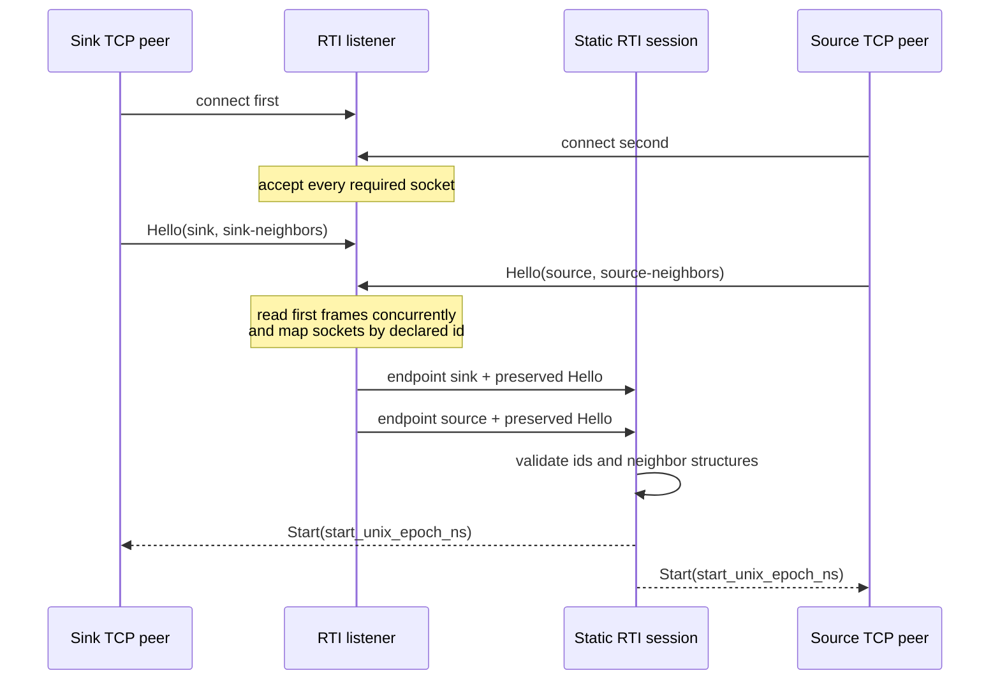
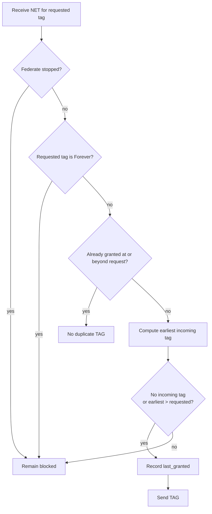
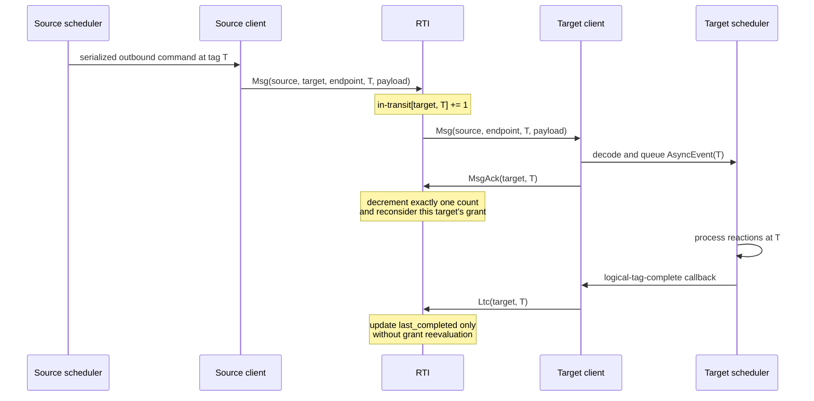
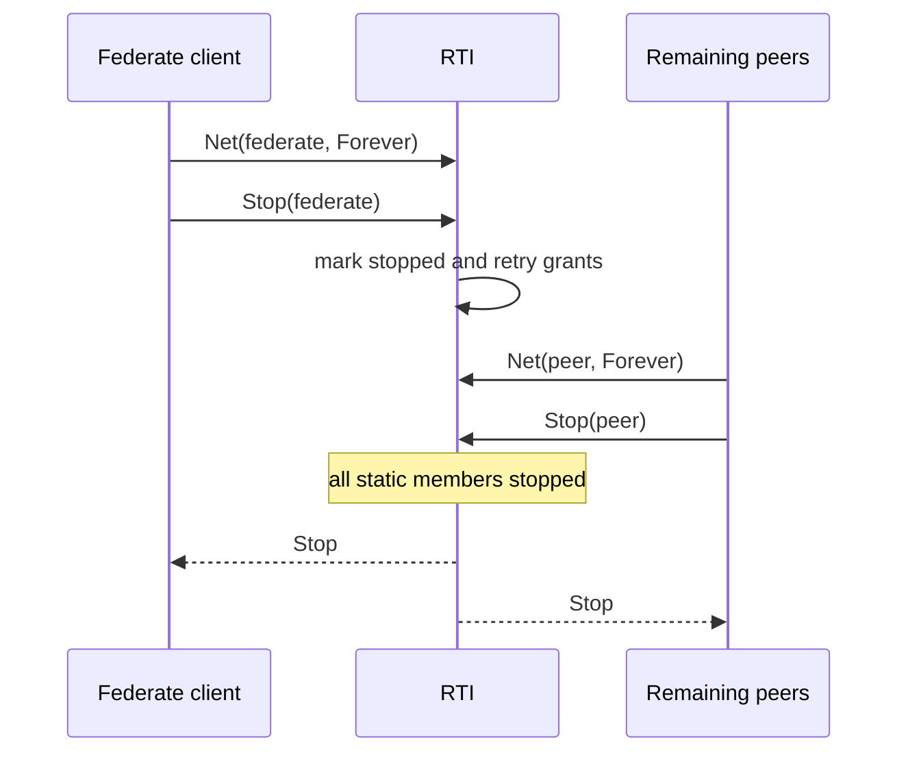

# Static Federated Protocol

This document describes the internal wire protocol used by Boomerang's static
federation runners. It is a maintainer reference for the protocol types in
`boomerang_federated/src/protocol.rs`, the RTI state machine in
`boomerang_federated/src/rti/mod.rs`, and the live client/session adapters in
`boomerang_federated/src/client.rs` and `boomerang_federated/src/session.rs`.
For crate ownership and scheduler integration, see
[Federated runtime internals](./federated-runtime.md).

The protocol is experimental. Compatibility between different Boomerang
versions is not guaranteed.

## Participants and Transport

A federate is one statically declared runtime enclave. Every federate has one
persistent, ordered, bidirectional connection to a centralized runtime
infrastructure process, abbreviated RTI. Payloads also travel through the RTI;
there are no direct peer-to-peer payload channels.

The in-memory runner transports `ProtocolFrame` values over ordered channels.
The TCP runner serializes the same frames as JSON inside a length-delimited
stream: a big-endian `u32` length followed by that many encoded bytes. TCP
connection order does not establish identity. The server accepts the static
number of sockets, reads their first frames concurrently, and keys each socket
by the federate id declared in `Hello`.



The `Start` frame carries a physical epoch for future clock coordination.
Current static runners require `Config::with_fast_forward(true)` and do not use
that epoch to synchronize scheduler clocks.

## Identities, Topology, and Tags

`FederateId` identifies one static federation member. `EndpointId` identifies
one directed serialized connection. `FederatedTopology` contains the complete
federate list and directed `TopologyEdge` values; each edge records its source,
target, endpoint, and minimum logical delay.

`WireTag` is independent of process-local clocks and architecture-sized
integers. It has three forms:

- `Never`, which sorts before every finite tag;
- `Finite { offset_ns, microstep }`, representing logical time; and
- `Forever`, which sorts after every finite tag and communicates no future
  event when used in `NET`.

A zero-delay edge preserves both components of a tag. A positive delay adds to
`offset_ns` and resets the microstep to zero.

## Frame Reference

Frames from a federate to the RTI are:

| Frame | Meaning | Important validation |
| --- | --- | --- |
| `Hello { federate_id, topology }` | Declares connection identity and the federate's neighbor view. | Must be the first frame, name a static member, match the endpoint identity, and exactly match the RTI-derived neighbor structure. |
| `Net { federate_id, tag }` | Announces the federate's next-event tag and requests permission to advance. | The embedded id must match the connection. A finite tag must be nonnegative and not precede the last completed tag. `Never` is invalid. `Forever` means no future event, is not itself granted, and cannot be followed by another `NET`. |
| `Msg { source, target, endpoint, tag, payload }` | Sends one serialized logical payload through the RTI. | Source must match the connection, both members and the exact route must exist, and the finite tag must be nonnegative. A message already sent by a peer may cross the target's `Stop` ordering; a stopped source cannot send another message. |
| `MsgAck { federate_id, tag }` | Confirms that exactly one matching `MSG` was decoded and queued in the target scheduler. | The finite tag must be nonnegative and match one in-transit count at the exact target and tag; unmatched or post-stop acknowledgments are protocol errors. |
| `Ltc { federate_id, tag }` | Reports that the scheduler completed reactions at the logical tag. | The finite tag must be nonnegative and cannot precede the completion high-watermark. It advances completion state only and does not acknowledge messages or trigger grant reevaluation. |
| `Stop { federate_id }` | Marks the federate stopped after it has sent no-future information. | The id must match the connection; later frames from that endpoint are rejected. |

Frames from the RTI to a federate are:

| Frame | Meaning |
| --- | --- |
| `Start { start_unix_epoch_ns }` | Completes the handshake after every valid `Hello`. |
| `Tag { tag }` | Grants permission to process the requested logical tag. |
| `Msg { source, endpoint, tag, payload }` | Delivers a routed payload to its target federate. |
| `Stop` | Confirms that the static session has received `Stop` from every member. |
| `Error { message }` | Reports a terminal protocol or RTI error to a federate. |

## Tag Grants

For each federate, the RTI stores its last completed tag, last granted tag,
advertised next-event tag, and stopped state. It also stores the number of
in-transit messages for every target and exact tag.

A requested tag is grantable only when the earliest possible incoming message
tag is strictly later than the request. The earliest incoming tag is the
minimum of:

- every outstanding in-transit message tag for the target; and
- every upstream federate's advertised `NET`, shifted by the corresponding
  topology-edge delay.



Grant reevaluation follows deterministic causal work sets instead of scanning
every federate:

- `NET` reevaluates the sender first, then its downstream targets in sorted
  federate-id order;
- `Stop` reevaluates downstream targets in sorted federate-id order;
- `MsgAck` reevaluates only the acknowledging target; and
- `MSG` can only add a blocking in-transit bound, so it cannot make a pending
  grant newly eligible; `LTC` is not part of the grant predicate. Neither
  triggers reevaluation.

All affected decisions are calculated before any state or grant high-watermark
is committed. This preserves sender-first and sorted-downstream delivery order
while preventing unrelated topology components from affecting an event.

## Message Delivery and Completion

Delivery into a scheduler queue and completion of scheduler work are separate
facts. The distinction prevents an early completion frame from clearing one or
more same-tag messages that have not actually reached the scheduler.



With two messages at the same tag, the first `MsgAck` leaves one in-transit
count and the dependent grant blocked. The second acknowledgment removes the
tag entry and permits the RTI to reconsider that grant. Sending `LTC` before
either acknowledgment changes completion state but leaves both counts intact.

## Shutdown

Normal shutdown is a federation-wide protocol. A federate first advertises
`NET(FOREVER)`, then sends `Stop`. The RTI treats it as having no future output,
retries grants that may have been blocked by that upstream federate, and waits
for every static member to stop before broadcasting the final `Stop`.



The barrier stop operation is idempotent. Runner error paths still attempt
no-future and `Stop` so that one failing scheduler does not strand its peers.

## Failure Semantics

The session authenticates every frame with the persistent endpoint that
supplied it and passes both identities to `RtiState::handle_from`. That is the
single production mutation boundary. It rejects a missing, duplicate, unknown,
or mismatched `Hello`; a non-`Hello` first frame; illegal tag sentinels or
negative finite tags; a route not present in the topology; an id that does not
match its transport endpoint; a duplicate post-start `Hello`; an unmatched
`MsgAck`; a regression behind completed time; an illegal stop transition; and
frames originating from an endpoint after `Stop`. Where possible it sends
`RtiToFederate::Error` before terminating the session.

An RTI event is failure-atomic: validation and fallible tag-delay calculations
finish against a staged copy of the one directly changed coordination record,
then the record and complete deterministic grant batch commit together. An
error leaves topology, lifecycle, completion, grants, and message counts equal
to their pre-event values.

Transport, codec, endpoint, RTI, and protocol failures become terminal barrier
errors. `Scheduler::try_next` returns before processing an ungranted pending
tag, and the static runner returns a contextual error after attempting orderly
federation shutdown. An error is never interpreted as a tag grant.

## Performance Considerations

The client keeps at most one outstanding `NET` for an unchanged next-event
request. Once that frame has been queued successfully, an unrelated inbound
message may interrupt the scheduler wait without causing the same `NET` to be
sent again. A distinct later request sends one new `NET`; a sufficient `TAG`,
normal stop, or a terminal protocol, transport, RTI, or runtime error clears the
outstanding request. This is an efficiency contract, not permission to suppress
`NET` frames whose requested tag has changed.

The current `MsgAck` contract sends exactly one control frame per successfully
decoded and queued delivered message. This is deliberately exact and keeps
same-tag accounting correct, but it can be expensive for high-rate
small-message traffic: each `MSG` adds another client write, serialization
step, RTI dispatch, and grant retry. Failed queue delivery is not acknowledged,
and neither `LTC` nor another same-tag acknowledgment substitutes for the
required one-to-one acknowledgment.

A future protocol may batch acknowledgments by target and tag, acknowledge
sequence ranges, or piggyback counts on another control frame. Any such change
must preserve these properties:

- only successfully queued messages are acknowledged;
- each message decrements the RTI count exactly once;
- one acknowledgment cannot accidentally clear other same-tag messages; and
- pending grants are reconsidered promptly enough to avoid artificial stalls.

Protocol trace tests distinguish causal requirements from incidental
implementation ordering. They assert exact counts, absence, bounded control
traffic, and relations such as forwarded `MSG` before matching `MsgAck` and
matching `MsgAck` before a grant that it unblocks. They assert a complete total
order only in the hand-driven reference session where the harness deliberately
chooses every exchange. Concurrently independent `NET`, `TAG`, and `LTC`
interleavings are not protocol contracts. The positive-delay-cycle reference
therefore uses a derived budget of one `NET`, one `TAG`, and one `LTC` per
federate and requested watermark rather than relying on thread timing.

The live command channels are also currently unbounded. Introducing bounded
backpressure requires care because blocking a scheduler reaction before its
barrier drains outbound commands can deadlock a logical tag.

## Protocol Non-Goals

The current protocol does not provide dynamic membership, reconnect,
authentication, direct peer payload channels, distributed wall-clock
synchronization, provisional tag grants (`PTAG`), absence messages (`ABS`), or
distributed zero-delay-cycle execution. Membership and topology are fixed
before the handshake.

## Defining Tests

The most focused protocol tests are located in:

- `boomerang_federated/src/rti/tests.rs` for grant, transition, topology, and
  in-transit accounting;
- `boomerang_federated/src/session.rs` for handshake, validation, and protocol
  ordering;
- `boomerang_federated/src/client.rs` for scheduler/client frame ordering; and
- `boomerang_federated/src/transport.rs` for in-memory framing and the ignored
  reversed-connection-order TCP proof.

Run the deterministic protocol suite with:

```sh
cargo test -p boomerang_federated --features runtime
```

Run the localhost TCP handshake proof with socket permission when required:

```sh
cargo test -p boomerang_federated tcp_smoke -- --ignored
```
