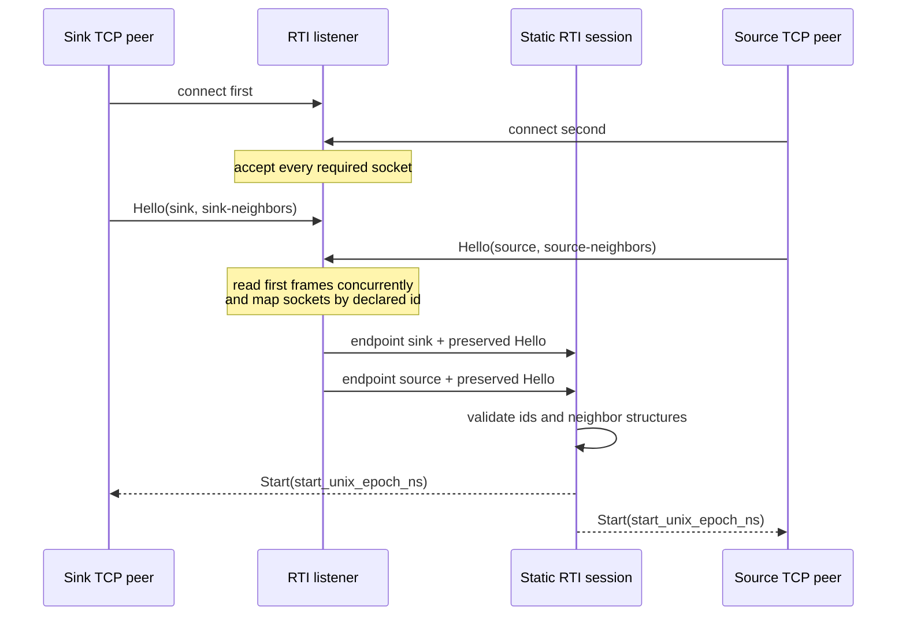
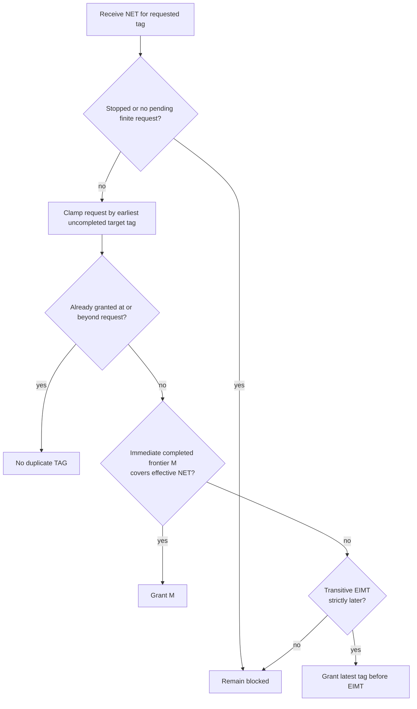
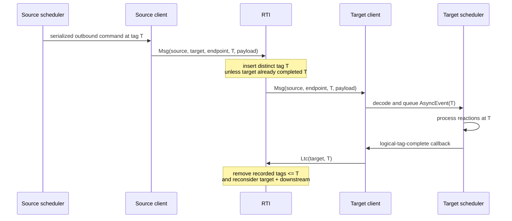
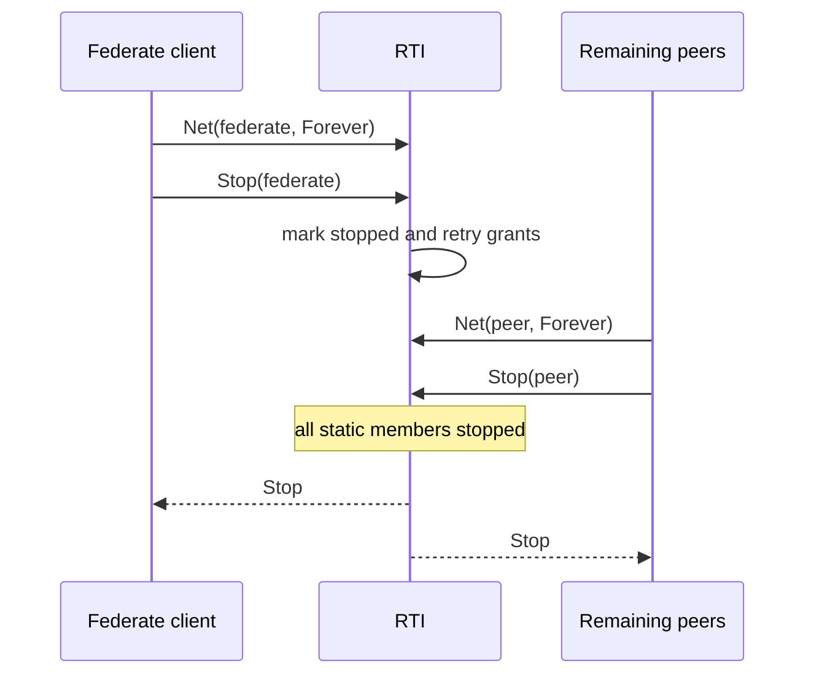

# Static Federated Protocol

This document describes the internal wire protocol used by Boomerang's static
federation runners. It is a maintainer reference for the protocol types in
`boomerang_federated/src/protocol.rs`, the RTI state machine in
`boomerang_federated/src/rti/mod.rs`, and the live client/session adapters in
`boomerang_federated/src/client.rs` and `boomerang_federated/src/session.rs`.
For crate ownership and scheduler integration, see
[Federated runtime internals](./federated-runtime.md).

The protocol is experimental. Compatibility between different Boomerang
versions is not guaranteed.

The coordination reference is the centralized subset implemented by reactor-c
commit `a98d9d3833de5fc5650f9f64dc4b085b982f3a3e`, interpreted together with
Sections 4.8 and 5.1 of “Quantifying and Generalizing the CAP Theorem”
([arXiv:2109.07771](https://arxiv.org/abs/2109.07771)). In particular, the
reference locations are `network/api/net_common.h`,
`core/federated/RTI/rti_common.c`, `core/federated/RTI/rti_remote.c`, and
`core/tag.c` at that commit. Boomerang implements the definitive-grant subset
for static topologies that reject distributed zero-delay cycles; the remaining
differences are listed under [Protocol Non-Goals](#protocol-non-goals).

## Participants and Transport

A Federate is one statically declared compute node or process containing one or
more runtime Enclaves. Every Federate has one persistent, ordered,
bidirectional connection to a centralized runtime infrastructure process,
abbreviated RTI. Payloads crossing Federate boundaries travel through the RTI;
same-Federate Enclave traffic stays in process, and there are no direct
peer-to-peer payload channels.

The in-memory runner transports `ProtocolFrame` values over ordered channels.
The TCP runner serializes the same frames as JSON inside a length-delimited
stream: a big-endian `u32` length followed by that many encoded bytes. TCP
connection order does not establish identity. The server accepts the static
number of sockets, reads their first frames concurrently, and keys each socket
by the federate id declared in `Hello`.



The `Start` frame carries a physical epoch for future clock coordination.
Current static runners require `Config::with_fast_forward(true)` and do not use
that epoch to synchronize scheduler clocks.

## Identities, Topology, and Tags

`FederateId` identifies one static federation member. `EndpointId` identifies
one directed serialized connection. `FederatedTopology` contains the complete
federate list and directed `TopologyEdge` values; each edge records its source,
target, endpoint, and minimum logical delay.

`WireTag` is independent of process-local clocks and architecture-sized
integers. It has three forms:

- `Never`, which sorts before every finite tag;
- `Finite { offset_ns, microstep }`, representing logical time; and
- `Forever`, which sorts after every finite tag and communicates no future
  event when used in `NET`.

A zero-delay edge preserves both components of a tag. A positive delay adds to
`offset_ns` and resets the microstep to zero.

## Frame Reference

Frames from a federate to the RTI are:

| Frame | Meaning | Important validation |
| --- | --- | --- |
| `Hello { federate_id, topology }` | Declares connection identity and the federate's neighbor view. | Must be the first frame, name a static member, match the endpoint identity, and exactly match the RTI-derived neighbor structure. |
| `Net { federate_id, tag }` | Announces the federate's next-event tag and requests permission to advance. | The embedded id must match the connection. A finite tag must be nonnegative and not precede the last completed tag. `Never` is invalid. `Forever` means no future event, is not itself granted, and cannot be followed by another `NET`. |
| `Msg { source, target, endpoint, tag, payload }` | Sends one serialized logical payload through the RTI. | Source must match the connection, both members and the exact route must exist, and the finite tag must be nonnegative. A message already sent by a peer may cross the target's `Stop` ordering; a stopped source cannot send another message. |
| `Ltc { federate_id, tag }` | Reports that the scheduler completed reactions through the logical tag. | The finite tag must be nonnegative and cannot precede the completion high-watermark. It clears the target's recorded in-transit tags through the completed tag and triggers causal grant reevaluation. |
| `Stop { federate_id }` | Marks the federate stopped after it has sent no-future information. | The id must match the connection; later frames from that endpoint are rejected. |

Frames from the RTI to a federate are:

| Frame | Meaning |
| --- | --- |
| `Start { start_unix_epoch_ns }` | Completes the handshake after every valid `Hello`. |
| `Tag { tag }` | Grants permission to process the requested logical tag. |
| `Msg { source, endpoint, tag, payload }` | Delivers a routed payload to its target federate. |
| `Stop` | Confirms that the static session has received `Stop` from every member. |
| `Error { message }` | Reports a terminal protocol or RTI error to a federate. |

## Tag Grants

For each federate, the RTI stores its last completed tag, last granted tag,
advertised next-event tag, stopped state, and an ordered set of distinct
uncompleted incoming tags. Multiple payloads at one tag occupy one set entry,
not one counter per payload. The effective next-event tag, or effective NET, is
the minimum of the advertised NET and the earliest tag in that set.

During builder lowering, `CompiledTopology` validates the static manifest and
precomputes each federate's sorted handshake neighbor view, immediate incoming
edges, sorted transitive upstream and downstream members, and the minimum
cumulative delay for every reachable ordered source/target pair. The lowered
runtime parts carry that immutable artifact into the clients and RTI session,
so startup neither repeats graph compilation nor scans all edges for every
`Hello`. Direct session users may still supply a raw topology, which is compiled
at that configuration boundary. Delay composition uses checked arithmetic. An
overflow rejects topology construction rather than producing a saturated bound.

The earliest incoming message tag (EIMT) for a target is the minimum, over all
transitive upstream members, of the upstream effective NET shifted by the
minimum cumulative path delay to the target. This allows an earlier source to
constrain a target through an intermediate federate even when that intermediate
federate currently advertises a later NET.

For a requested effective NET `N`, the definitive grant calculation follows
the pinned reactor-c subset:

1. Compute `M`, the minimum of each immediate upstream member's completed tag
   shifted by that edge's delay. If `M` is later than the target's last grant
   and `M >= N`, grant `M`.
2. Otherwise compute transitive EIMT. If EIMT is later than `N` and the latest
   tag strictly before EIMT is later than the last grant, grant that predecessor.
3. Otherwise remain blocked.

The latest tag before `(time, microstep)` decrements the microstep when it is
positive. At microstep zero it decrements time and uses the maximum microstep.
`Forever` remains `Forever`. A member with no incoming topology dependency is a
Boomerang extension: it receives its requested effective tag directly so
source-only schedulers still use the same barrier contract.



Grant reevaluation follows deterministic causal work sets instead of scanning
every federate:

- `NET` reevaluates the sender first, then every transitive downstream member
  in sorted federate-id order;
- `LTC` reevaluates the completing member first, then every transitive
  downstream member in sorted federate-id order;
- `Stop` reevaluates every transitive downstream member in sorted federate-id
  order; and
- `MSG` records a conservative tag bound, so it cannot make a pending grant
  newly eligible and does not trigger reevaluation.

All affected decisions are calculated before any state or grant high-watermark
is committed. This preserves sender-first and sorted-downstream delivery order
while preventing unrelated topology components from affecting an event.

## Message Delivery and Completion

The protocol has no per-payload receipt frame. Its safety argument instead
depends on ordered transport and terminal admission failures. A source's
reaction-emitted `MSG(T)` enters the same FIFO mailbox before its later
`LTC(T)` or NET. The RTI processes each source stream sequentially and awaits
forwarding before reading the next source frame. The target consumes its RTI
stream sequentially and validates, decodes, and queues every preceding `MSG`
before it can consume a later `TAG`. If transport, protocol, routing, decoding,
runtime-endpoint, or scheduler admission fails before queueing, the target
barrier becomes terminal and cannot consume a queued later grant.



With two messages at the same tag, both are forwarded and admitted in stream
order before a later grant can be consumed, while the RTI stores only one tag
entry. `LTC(T)` is sent after the scheduler completes all work at `T`; it removes
that entry and every earlier entry. A late message at or before the completion
watermark is still forwarded under the existing lifecycle tolerance but does
not recreate stale in-transit state.

## Shutdown

Normal shutdown is a federation-wide protocol. A federate first advertises
`NET(FOREVER)`, then sends `Stop`. The RTI treats it as having no future output,
retries grants that may have been blocked by that upstream federate, and waits
for every static member to stop before broadcasting the final `Stop`.



The barrier stop operation is idempotent. Runner error paths still attempt
no-future and `Stop` so that one failing scheduler does not strand its peers.

## Failure Semantics

The session authenticates every frame with the persistent endpoint that
supplied it and passes both identities to `RtiState::handle_from`. That is the
single production mutation boundary. It rejects a missing, duplicate, unknown,
or mismatched `Hello`; a non-`Hello` first frame; illegal tag sentinels or
negative finite tags; a route not present in the topology; an id that does not
match its transport endpoint; a duplicate post-start `Hello`; a regression
behind completed time; an illegal stop transition; and
frames originating from an endpoint after `Stop`. Where possible it sends
`RtiToFederate::Error` before terminating the session.

An RTI event is failure-atomic: validation and fallible tag-delay calculations
finish against a staged copy of the one directly changed coordination record,
then the record and complete deterministic grant batch commit together. An
error leaves topology, lifecycle, completion, grants, and in-transit tags equal
to their pre-event values.

Transport, codec, endpoint, RTI, and protocol failures become terminal barrier
errors. `Scheduler::try_next` returns before processing an ungranted pending
tag, and the static runner returns a contextual error after attempting orderly
federation shutdown. An error is never interpreted as a tag grant.

## Performance Considerations

The client keeps at most one outstanding `NET` for an unchanged next-event
request. Once that frame has been queued successfully, an unrelated inbound
message may interrupt the scheduler wait without causing the same `NET` to be
sent again. A distinct later request sends one new `NET`; a sufficient `TAG`,
normal stop, or a terminal protocol, transport, RTI, or runtime error clears the
outstanding request. This is an efficiency contract, not permission to suppress
`NET` frames whose requested tag has changed.

Removing per-payload acknowledgments eliminates one reverse control frame, one
serialization step, and one RTI transition for every routed payload. The RTI's
tag-set memory grows with distinct uncompleted tags rather than payload
cardinality. This relies on the ordered-channel and terminal-admission contract;
a future transport that multiplexes or reorders frames must re-establish that
contract before it can replace the current streams.

Protocol trace tests distinguish causal requirements from incidental
implementation ordering. They assert exact counts, absence, bounded control
traffic, and relations such as every forwarded `MSG` before a dependent grant
and target `LTC` before the downstream grant it releases. They assert a
complete total order only in the hand-driven reference session where the
harness deliberately chooses every exchange. Concurrently independent `NET`, `TAG`, and `LTC`
interleavings are not protocol contracts. The positive-delay-cycle reference
therefore uses a derived budget of one `NET`, one `TAG`, and one `LTC` per
federate and requested watermark rather than relying on thread timing.

The live command channels are also currently unbounded. Introducing bounded
backpressure requires care because blocking a scheduler reaction before its
barrier drains outbound commands can deadlock a logical tag.

## Protocol Non-Goals

The current protocol deliberately differs from the broader LF implementation.
It uses static membership and a complete topology manifest, centralized RTI
payload routing, simplified `Hello`/`Start` and no-future/`Stop` exchanges,
fast-forward clocks, and source-only TAGs. It does not implement dynamic
membership, reconnect, authentication, direct peer payload channels,
distributed wall-clock synchronization, provisional tag grants (`PTAG`),
absence messages (`ABS`), tagged-message absence negotiation (`TAN`/`DNET`), or
distributed zero-delay-cycle execution. Membership and topology are fixed
before the handshake, and zero-delay distributed cycles are rejected during
lowering. The `ACK` constant in reactor-c is a connection-handshake concept;
Boomerang does not use it and has no corresponding per-payload receipt frame.

## Defining Tests

The most focused protocol tests are located in:

- `boomerang_federated/src/rti/tests.rs` for grant, transition, topology, and
  LTC-cleared in-transit tag tracking;
- `boomerang_federated/src/session.rs` for handshake, validation, and protocol
  ordering;
- `boomerang_federated/src/client.rs` for scheduler/client frame ordering; and
- `boomerang_federated/src/transport.rs` for in-memory framing and the ignored
  reversed-connection-order TCP proof.

Run the deterministic protocol suite with:

```sh
cargo test -p boomerang_federated --features runtime
```

Run the localhost TCP handshake proof with socket permission when required:

```sh
cargo test -p boomerang_federated tcp_smoke -- --ignored
```
