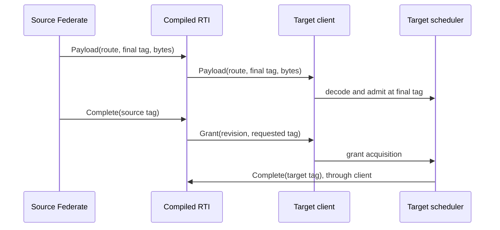

# Compiled Central RTI Protocol

This note describes the current compiled `central-rti` coordination backend.
Its requests and replies are defined in
[compiled/mod.rs](../boomerang_central_rti/src/compiled/mod.rs), state transitions
in [compiled/state.rs](../boomerang_central_rti/src/compiled/state.rs), and runtime
integration in [compiled/client.rs](../boomerang_central_rti/src/compiled/client.rs).
See [runtime internals](./federated-runtime.md) for crate ownership.

The hosted framing is experimental and versioned. It is not a stable public
protocol or a guarantee of compatibility between Boomerang versions.

## Canonical bounded protocol (Phase 6A)

[`boomerang_federated::wire`](../boomerang_federated/src/wire.rs) defines the transport-independent
protocol consumed by the subsequent Phase 6B Tokio `Framed` adapter. The current hosted TCP path
below retains its Phase 5 framing until that adapter lands. The canonical codec owns no I/O,
queues, reliability, grant decisions, or executor. It borrows caller-owned buffers and immutable
member/route tables, preserving their actual typed key domains.

A complete frame starts with a big-endian `u32` body length, followed by a Serde-derived
Postcard record: zero flags, then record discriminant 0 (handshake) or 1 (traffic).
The handshake fields are protocol `u16`, codec `u16`, coordination `[u8;32]`, epoch `u64`,
incarnation `u64`, mapping `[u8;32]`, and borrowed member text, in that order. Traffic contains
zero epoch/incarnation values followed by the derived message enum. Nonzero reserved fields fail closed.
Postcard uses minimal unsigned varints, ZigZag signed integers, and varint string/byte lengths.
Tags encode Never=0, finite=1 plus `i128` nanoseconds and `u64` microstep, or Forever=2; no padding.

| Traffic kind | Fields after the discriminant |
| --- | --- |
| 0 publish / NET | Revision `u64`, optional tag. |
| 1 complete / LTC | Tag. |
| 2 payload to RTI; 8 payload to Federate | Route `u32`, tag, borrowed payload bytes. |
| 3 confirm idle; 9 idle | Revision `u64`. |
| 4 stop; 6 started; 10 stopped | Empty. |
| 5 abort; 11 failed | Borrowed diagnostic text. |
| 7 grant / TAG | Revision `u64` and tag. |
| 12 PTAG; 13 port ABS | Reserved; rejected. |

Participants always upgrade atomically as a closed world. Protocol, codec, and fingerprint
matching are exact; there is no backward-compatible decoder or version negotiation. Canonical
re-serialization is compared directly against input bytes using a Postcard sink; it allocates no buffer.

The baseline profile permits at most 65,535 encoded payload bytes, 1,024 diagnostic bytes,
255 member-name bytes, and 65,582 total frame bytes. These are encoded-message limits, not
scheduler aggregate storage bounds. Both endpoints match the same compiled channel member, coordination,
protocol, codec, and mapping before interpreting route references. The RTI echoes the channel's
Federate identity; it does not acquire an invented Federate key. The hosted adapter enforces
upstream/downstream message direction before dispatch. Unknown routes, wrong route
ownership, malformed or trailing bytes, and protocol errors terminate the session. Stable names
appear only during preflight; normal route resolution uses the borrowed typed table.

[`PostcardCodec`](../boomerang_federated/src/wire/payload.rs) derives value encoding through Serde
and Postcard 1.x: minimal integer varints, ZigZag signed integers, little-endian IEEE floats,
and UTF-8 strings. Supported values are sealed allocation-free scalars, borrowed strings/bytes,
fixed arrays, and pairs. Architecture-sized integers and allocating collections are excluded.
Each codec declares a compile-time maximum. Decoding checks the byte limit before deserialization,
requires exact consumption, and re-encodes into caller scratch to reject alternate encodings.
The original Postcard error remains available until the hosted adapter normalizes it.

## Participants, images, and transport

A Federate may contain multiple Enclaves. Each distributed Federate has one
persistent ordered connection to the central RTI. Payloads travel through that
RTI; same-Federate traffic remains local.

The canonical compiler validates the complete topology and emits an immutable
`RtiImage` with direct dependencies, transitive dependency delays, affected
members, and routes. The runtime does not accept a replacement raw topology or
recompute its analysis during admission.

A hosted connection binds a stable member name once and resolves it to the
image's `FederateIndex`. `Hello` verifies the shared `CoordinationIdentity` before
any execution. Subsequent `RtiRouteIndex` values belong to that admitted image;
they are not process-local Enclave route keys. Socket arrival order does not
establish membership.

[compiled/hosted.rs](../boomerang_central_rti/src/compiled/hosted.rs) implements
bounded binary frames with a big-endian `u32` length prefix, explicit fixed-width
fields, a one-MiB frame limit, and bounded queues. JSON is an application payload
codec, not the control-frame encoding. The transport uses nonblocking socket I/O
and deadlines without a Tokio runtime. In-memory transport exercises the same
ordered interfaces for testing and reference execution only.

## Tags and delays

The portable `boomerang_federated` crate also owns `WireTag` and `WireDelay`.
`WireTag` orders `Never` before finite `{ offset_ns, microstep }` tags and
`Forever` after them. Executable events use finite nonnegative tags. Checked
conversions preserve sentinels and reject runtime or wire values outside the
representable domain.

Zero delay preserves both tag components. Positive delay adds to the offset and
resets the microstep to zero. Delay arithmetic is checked. Outbound adapters
apply the route delay once; payload requests carry the final destination tag.

## Requests and replies

`RtiRequest` is associated with its already-bound member connection:

| Request | Meaning and validation |
| --- | --- |
| `Hello { identity }` | Verify the compiled coordination identity once; all members must be admitted before execution. |
| `Publish { revision, next_event }` | Publish a reversible candidate. `Some(tag)` requests finite work after completed time; `None` means locally idle. Revisions cannot regress or change meaning at the same revision. |
| `Complete { tag }` | Report completed work within the granted horizon; completion cannot regress. Remove incoming in-transit tags through this tag. |
| `Payload { route, tag, payload }` | Submit an encoded value on an owned compiled source route within its grant and delay bounds. Reject completed, idle-authorized, or stopped destinations. |
| `ConfirmIdle { revision }` | Request a terminal fixed-point check for the matching local-idle publication. |
| `Stop` | Commit a stop only after global idle authority. |
| `Abort { message }` | Fail the session and preserve its failure diagnostic. |

`RtiReply` is delivered on the same ordered member stream:

| Reply | Meaning |
| --- | --- |
| `Started` | All expected artifacts passed identity admission. |
| `Grant { revision, tag }` | Authorize the named publication at its requested tag. |
| `Payload { route, tag, payload }` | Deliver a value through the preflighted local inbound adapter. |
| `Idle { revision }` | Authorize global quiescence for this local-idle revision. |
| `Stopped` | Acknowledge this member's terminal stop. |
| `Failed { message }` | Report terminal session failure. |

## Definitive grants

Each member has a publication, completed and granted frontiers, lifecycle state,
and a set of distinct incoming tags not yet covered by completion. Multiple
payloads at one tag occupy one set entry. The earliest possible upstream work is
the minimum of its publication and earliest in-transit tag. Before publication
it is `Never`; a locally idle publication contributes `Forever`, but incoming
payloads still constrain it.

For a finite requested tag, `CompiledRti` uses precomputed bounds:

1. Check every direct upstream completion shifted by its edge delay. A zero-delay
   bound covers an equal requested tag. A positive-delay bound must be strictly
   later: later source microsteps at the same offset collapse onto the same
   destination tag after positive delay.
2. If those completion bounds do not establish safety, require every transitive
   upstream earliest-work bound, shifted by its minimum cumulative delay, to be
   strictly later than the request.
3. Grant the requested tag and publication revision only when one of those
   proofs succeeds. A member with no upstream dependencies can proceed directly.

Accepted requests reconsider the sender and its compiler-projected affected
members. Completion clears in-transit bounds and may therefore release a
previously blocked downstream request. Topology analysis and zero-delay-cycle
rejection remain compiler responsibilities.

## Ordered payload admission

A source submits payloads before its completion report. The RTI returns payload
deliveries before grants made possible by the same transition. Ordered transport
preserves that order, and `CentralRtiClient` decodes and admits each payload
before exposing a later grant to the Federate coordinator.


```mermaid
sequenceDiagram
    participant S as Source Federate
    participant R as Compiled RTI
    participant C as Target client
    participant T as Target scheduler
    S->>R: Payload(route, final tag, bytes)
    R->>C: Payload(route, final tag, bytes)
    C->>T: decode and admit at final tag
    S->>R: Complete(source tag)
    R->>C: Grant(revision, requested tag)
    C->>T: grant acquisition
    T->>R: Complete(target tag), through client
```

There is no per-payload receipt frame. Multiple values at one tag are admitted
in stream order before a following grant; completion clears the RTI's tag entry.
A routing, decode, or admission error makes the client terminal. It cannot skip
the failed payload and consume a queued grant. A payload at or before destination
completion, or after destination idle authority or stop, fails the session.

## Quiescence and failure

Local idle is not terminal. `Publish { next_event: None, .. }` leaves the member
wakeable for incoming work. `ConfirmIdle` must name its current idle revision.
Only when every member has a matching idle confirmation and every in-transit
set is empty does the RTI emit `Idle`. The runtime rechecks its local fixed point
before committing `Stop`; the RTI replies `Stopped` to that member.

Invalid admission, route or tag use, lifecycle transitions, transport failure,
and explicit `Abort` terminate coordination. `CompiledRti::handle` retains the
first failure and returns `Failed` on subsequent requests. This is fail-stop
execution, with no recovery by continuing after a protocol error. A client
without global idle authority aborts during cleanup instead of reporting a
successful normal stop.

## Scope and tests

The current backend supports static membership, logical-tag coordination,
centralized payload routing, and fail-stop recovery. It does not implement
reconnection, dynamic membership, distributed wall-clock synchronization,
provisional grants, absence negotiation, direct peer routing, or constructive
zero-delay distributed cycles. Future protocols must preserve the compiled
boundary and coordination contracts.

The deterministic regression suites cover transitive blocking, in-transit
clearance, positive-delay cycles, revision validation, ordered multiple-payload
admission, and terminal decode failure before a queued grant:

- [RTI state tests](../boomerang_central_rti/src/compiled/state/tests.rs)
- [Client tests](../boomerang_central_rti/src/compiled/tests.rs)
- [Compiled execution tests](../boomerang_central_rti/tests/compiled_execution.rs)
- [Hosted transport tests](../boomerang_central_rti/src/compiled/hosted/tests.rs)
- [Pure wire primitive tests](../boomerang_federated/src/protocol.rs)

```sh
cargo test -p boomerang_central_rti --offline
cargo test -p boomerang_federated --offline
```
