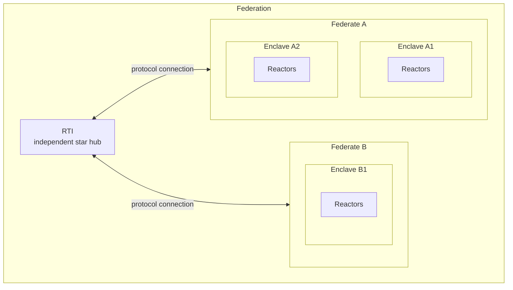
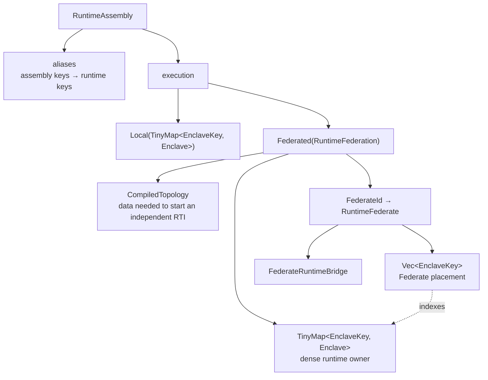

# Federated Runtime Internals

Boomerang separates four runtime concepts. A **Reactor** is an application component. An
**Enclave** is a group of Reactors executed by one scheduler, normally on one thread. A
**Federate** is one deployable compute node or process and owns one or more Enclaves. A
**Federation** is the complete distributed graph. The **RTI** (runtime infrastructure) is an
independent hub that grants logical time and relays messages between Federates.

These boundaries select the delivery mechanism. A connection inside one Enclave is direct. A
connection between Enclaves owned by the same Federate uses
`InProcessInterPartitionEventSink` and local scheduler channels. Only a connection whose
endpoints belong to different Federates is serialized and represented by an RTI topology edge.

## Build-to-runtime workflow

`boomerang_builder::Assembly` is the mutable declaration graph. The consuming
`Assembly::into_runtime_assembly` pass validates placement, analyzes connection boundaries,
allocates Enclaves, installs local crosslinks, constructs protocol bridges, and returns:

`RuntimeAssembly::into_local` and `RuntimeAssembly::into_federation` are typed conversions. A
local runner cannot accidentally discard federation metadata, and Federate placement remains
explicit rather than changing globally allocated Enclave keys.

`RuntimeFederation::into_parts` returns the immutable compiled topology, the dense Enclave map,
and a deterministic map of `RuntimeFederate` placement and bridge metadata. It contains no RTI
thread or task. A deployment launcher may start the RTI independently and assign Enclaves to
compute nodes from those key lists. The single-process static runner consumes the same value and
supplies in-memory or TCP transports.

## Placement and lowering

`ReactorPlacement::Federate(spec)` opens a Federate scope and starts its initial Enclave. A
descendant declared with `ReactorPlacement::Enclave` starts another scheduler while inheriting
the nearest Federate. Nested Federate scopes, duplicate Federate IDs, and connections with only
one endpoint in a Federate are rejected before execution.

Partition analysis records the Federate inherited by every Enclave root. Same-Federate
cross-Enclave boundaries remain local and do not require a payload codec. Cross-Federate
boundaries produce an `EndpointId`, `TopologyEdge`, encoder, serialized sender, inbound decoder,
and target action route.

The aggregate `FederatedRuntimeConnections` value exists only during lowering. Finalization
consumes it, validates every Federate-to-Enclave assignment against the dense map, and produces
one `FederateRuntimeBridge` per `RuntimeFederate`.

## Scheduler and RTI coordination

Every Enclave retains an independent scheduler. Within a Federate, one gateway Enclave owns the
blocking `RtiLogicalTimeCoordinator`; the other Enclaves use the runtime's local upstream and
downstream barriers and feed the gateway through in-process crosslinks. This avoids treating one
protocol client as several independent RTI participants while preserving scheduler parallelism.

The RTI remains a star. Each Federate has one protocol identity and connection. Outbound
serialized messages enter that Federate's FIFO mailbox before logical-time completion is
reported. Incoming messages select a stable endpoint route, decode the payload, and schedule the
target action in the correct owned Enclave.

## Ownership map

- `boomerang_runtime` owns protocol-neutral Enclave types, dense maps, schedulers, local
  crosslinks, and `InterPartitionEventSink`.
- `boomerang_federated` owns codecs, serialized sinks, endpoint/fault types, protocol clients,
  `FederateRuntimeBridge`, `RuntimeFederate`, `RuntimeFederation`, RTI state, sessions, and
  transports.
- `boomerang_builder` owns declarations, placement analysis, topology projection, codec
  registration, pending bindings, and the `RuntimeAssembly` lowering result.
- `boomerang` exposes application-facing execution functions that consume `RuntimeFederation`.

The dependency direction is `boomerang_builder → boomerang_federated → boomerang_runtime` for
runtime integration. `boomerang_runtime` has no federation feature and no protocol dependency.

## Behavioral proof

`boomerang/tests/federated_static.rs` builds Federate A with a source Enclave and a relay Enclave,
plus Federate B with a sink Enclave. Source-to-relay stays in process; relay-to-sink is the only
compiled RTI endpoint. The same graph runs through the in-memory and TCP runners and records the
value at the expected complete logical tag.

The builder and federated crate tests additionally cover duplicate and nested placement errors,
codec failures, delayed connections, fanout, cycles, route validation, dense-key preservation,
and Federate placement.
