# Federated Runtime Internals

This note records the current static federation design after the in-memory
runtime work. It is internal developer documentation, not an end-user guide.
The user-facing static federation documentation lives in
`book/src/static-federation.md`.

## Current Scope

The implemented runtime path supports static, persistent federates connected by
logical cross-federate messages. A federate is represented as a runtime enclave
and is coordinated by an RTI, short for runtime infrastructure. The RTI receives
federate timing and message frames, decides when tags are safe to process, and
routes payload messages between federates.

The supported paths are the deterministic in-memory static runner and a
single-process TCP static runner. Both run the same scheduler/barrier lifecycle
and differ only in how the RTI session and federate protocol clients are
connected.

## Crate Ownership

`boomerang_runtime` owns scheduler-facing primitives only. It defines endpoint
ids, payload codec traits, outbound sinks and receivers, inbound endpoint
registries, the shared first-error fault latch, and the `FederatedTimeBarrier`
scheduler hook. The barrier returns an explicit granted or interrupted outcome,
or a terminal coordination error. It must stay
protocol-free and must not depend on `boomerang_federated`, Tokio, RTI state, or
wire frame types.

`boomerang_federated` owns the protocol and orchestration layer. It defines wire
types, `RtiState`, `StaticRtiSession`, `FederateProtocolClient`,
`RtiFederatedTimeBarrier`, in-memory and TCP protocol transports, and
`static_runner::execute_federation_in_memory` and
`static_runner::execute_federation_over_tcp`.

`boomerang_builder` owns topology validation and lowering. It turns builder
metadata into a `FederationPlan`, validates unsupported topology shapes, lowers
builder runtime parts into `boomerang_federated::StaticFederationRuntimeParts`,
and exposes thin builder-facing `execute_federation_in_memory` and
`execute_federation_over_tcp` shims.

The top-level `boomerang` crate should only re-export public APIs.

## Shared Execution Flow

The following block diagram shows a one-way source-to-sink federation. Solid
arrows are runtime data or coordination flow. Dashed arrows are construction or
route installation performed before the schedulers start. The transport blocks
represent either the in-memory channels or the TCP connections used by the two
static runners.

```mermaid
flowchart LR
    Builder["EnvBuilder<br/>reactors, ports, connection"]
    Parts["BuilderRuntimeParts<br/>enclaves, plan, router,<br/>fault state, inbound registry"]
    Runner["Static federation runner<br/>validates topology and installs routes"]
    Faults["FederatedFaultState<br/>shared first terminal endpoint error"]

    Builder -->|lower| Parts
    Parts -->|runtime parts| Runner

    subgraph Source["Source federate / enclave"]
        SchedA["Scheduler A"]
        SourceReaction["Source reaction<br/>writes output port"]
        SenderReaction["FederatedSenderReactionFn<br/>encode payload + runtime tag"]
        Router["FederatedOutboundRouter<br/>endpoint → channel"]
        OutChannel["FederatedOutboundChannel"]
        OutReceiver["FederatedOutboundReceiver"]
        BarrierA["RtiFederatedTimeBarrier A"]
        ClientA["FederateProtocolClient A"]

        SchedA --> SourceReaction --> SenderReaction --> Router
        Router --> OutChannel --> OutReceiver --> BarrierA
        SchedA -->|tag request / completion| BarrierA
        BarrierA -->|grant or inbound interrupt| SchedA
        BarrierA -->|NET, MSG, LTC, Stop| ClientA
        ClientA -->|TAG, MSG, Error| BarrierA
    end

    subgraph Coordination["Federated protocol and coordination"]
        TransportA["In-memory or TCP transport A"]
        RTI["StaticRtiSession + RtiState<br/>grant calculation, in-transit counts,<br/>message routing"]
        TransportB["In-memory or TCP transport B"]

        ClientA --> TransportA --> RTI
        RTI --> TransportA --> ClientA
    end

    subgraph Target["Target federate / enclave"]
        ClientB["FederateProtocolClient B"]
        BarrierB["RtiFederatedTimeBarrier B"]
        Registry["FederatedInboundEndpointRegistry<br/>endpoint → logical action"]
        EventQueue["Scheduler event queue<br/>AsyncEvent"]
        SchedB["Scheduler B"]
        ReceiverReaction["ConnectionReceiverReactionFn<br/>logical action → input port"]
        TargetReaction["Target reaction<br/>reads input port"]

        ClientB -->|TAG, MSG, Error| BarrierB
        BarrierB -->|decoded MSG| Registry --> EventQueue --> SchedB
        SchedB --> ReceiverReaction --> TargetReaction
        SchedB -->|tag request / completion| BarrierB
        BarrierB -->|grant or inbound interrupt| SchedB
        BarrierB -->|NET, MsgAck, LTC, Stop| ClientB
    end

    RTI --> TransportB --> ClientB
    ClientB --> TransportB --> RTI

    Runner -. creates schedulers and clients .-> SchedA
    Runner -. installs endpoint route .-> Router
    Runner -. creates protocol session .-> RTI
    Runner -. supplies inbound registry .-> Registry
    Runner -. shares fault state .-> Faults
    SenderReaction -. records codec or send failure .-> Faults
    BarrierA -. checks before protocol progress .-> Faults
    BarrierB -. checks before protocol progress .-> Faults
```

The router is deliberately below the protocol boundary: it handles
`FederatedOutboundCommand` values and runtime endpoint ids, not wire frames.
`RtiFederatedTimeBarrier` drains the selected receiver and is the first
component that translates those commands into protocol `MSG` frames.

`add_child_federate` builds a child reactor with `ReactorPlacement::Federate`.
Federate placement starts a runtime enclave, so a source/sink federation has one
enclave for the source federate and one enclave for the sink federate. Empty
unmapped enclaves, such as a structural root with no reactions, are skipped by
the runner. Non-empty unmapped enclaves are rejected.

`EnvBuilder::into_runtime_parts` produces `BuilderRuntimeParts` containing the
runtime enclaves, builder aliases, inter-partition metadata, the federation
plan, a federated outbound router, shared federated fault state, and the
inbound endpoint registry.

The builder-facing execution functions validate the builder-owned plan and
convert it into protocol/runtime DTOs: a `FederatedTopology`, client routes,
and a federate-to-enclave map. They then delegate to the matching function in
`boomerang_federated::static_runner`.

The static runner first validates and prepares transport-independent runtime
parts, then rejects configurations without `Config::with_fast_forward(true)`.
Static federation does not yet have a common physical start, so silently using
independent scheduler clocks would be incorrect. The in-memory path creates one
channel transport per federate and starts `StaticRtiSession` directly. The TCP
path binds a listener, starts `run_tcp_static_rti_session`, accepts the static
number of sockets, and identifies each peer from its first `Hello` frame rather
than arrival order. The consumed frame is preserved for the session's topology
validation. Both paths then run
all `FederateProtocolClient::connect` handshakes concurrently, wrap each client
in an `RtiFederatedTimeBarrier`, and enter the same connected-runner function.
That function runs one scheduler thread per active mapped federate enclave with
`Scheduler::new_with_federated_time_barrier`. It uses the fallible scheduler
loop, stops every barrier after success or failure, and returns coordination or
runtime endpoint errors to the public caller.

The connected runner retains an outbound sender and receiver pair for every
federate until shutdown, including federates with no outbound route. This keeps
the receiver open while the barrier drains it before sending final no-future
and `Stop` frames.

Outbound payloads leave a scheduler through generated federated sender
reactions. Codec and sink failures are published to the shared first-error
fault latch and become terminal scheduler errors. Those reactions write to a
`FederatedOutboundRouter`. The static runner installs every endpoint route
before scheduler execution; a missing route returns `UnknownEndpoint` instead
of retaining an undeliverable command. Installed routes send to the source
federate's `FederatedOutboundReceiver`. The barrier drains that receiver during
`logical_tag_complete`, sends protocol `MSG` frames, and then sends `LTC` for
the completed scheduler tag.

Inbound payloads arrive as protocol `MSG` frames from the RTI. The barrier
schedules them through `FederatedInboundEndpointRegistry`, returns the queued
`AsyncEvent` to the scheduler, and sends one `MsgAck` after successful queueing.
`MsgAck` decrements exactly one matching in-transit message. The scheduler sends
the distinct `LTC` frame only after reactions at that tag complete; `LTC` does
not acknowledge delivery or clear in-transit counts.

Shutdown uses no-future information. A federate that has no future local events
sends `NET(FOREVER)` before `Stop`. The RTI records this as no-future state for
that federate and retries pending grants for downstream federates.

## Semantics and Non-Goals

The current implementation supports same-tag messages, same-timestamp
microsteps, fanout, multi-hop topologies, shutdown/no-future coordination, and
positive-delay distributed cycles.

The builder and runner preserve rejection of unsupported semantics:
cross-federate physical connections, transient federates, mixed local/federated
boundaries, and distributed zero-delay cycles. Do not add distributed
zero-delay-cycle support until `PTAG` and `ABS` are designed and implemented.
`PTAG` is a provisional tag grant. `ABS` is an absence signal for an upstream
port at a tag. The current runtime does not emit the per-port absence
information needed for constructive zero-delay distributed cycles.

Keep Tokio, wire protocol code, RTI sessions, and federate protocol clients in
`boomerang_federated`. Do not move those dependencies into
`boomerang_runtime`.

## Tests That Define the Current Behavior

`boomerang/tests/federated_static.rs` contains the public API proofs. The
non-ignored test calls `execute_federation_in_memory`; the ignored localhost
test calls `execute_federation_over_tcp`. Both build through
`boomerang::prelude`, register `SerdeJsonCodec`, and assert that the sink
observes `[(Tag::ZERO, 7)]`.

`boomerang_builder/src/tests/federated.rs` contains builder and live in-memory
coverage for topology lowering, rejection behavior, three-federate chains,
fanout, and positive-delay cycles.

`boomerang_federated/src/rti.rs` and `boomerang_federated/src/session.rs` cover
RTI and protocol ordering without running full schedulers, including same-tag
messages, microstep progression, multi-hop grant dependencies, and grant
blocking behind in-transit messages.

The ignored TCP smoke in `boomerang_federated/src/transport.rs` remains a
narrow protocol-level test of the shared RTI session and client, including
sink-before-source connection order and `Hello`-based identity. The ignored
top-level test adds scheduler-running TCP coverage without replacing any
direct in-memory correctness test.
