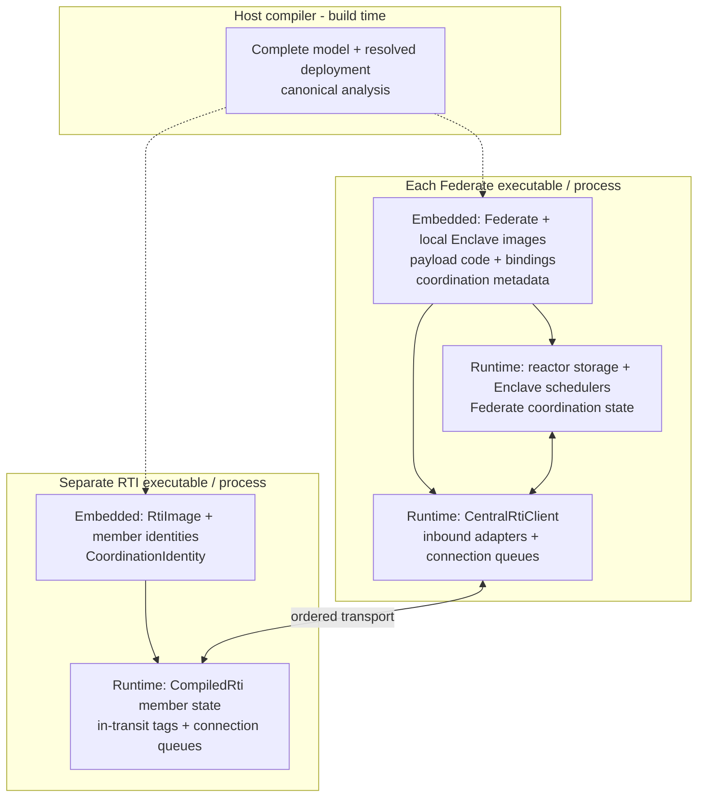

# Compiled Federate Runtime Internals

Compiled execution consumes immutable Federate and Enclave images produced by the
canonical host compiler. A Federate owns one or more Enclaves, their local routes,
and one process lifecycle. Compiled Federates, boundary adapters, and coordination
interfaces are unconditional; there is no user-facing `federated` Cargo feature.

A one-Federate deployment uses local coordination without an RTI dependency. A
multi-Federate deployment explicitly selects a coordination backend. The current
`central-rti` backend consumes a compiler-produced `RtiImage`; generated hosted
artifacts communicate with a separate RTI process over ordered TCP connections.
The in-memory implementation is reference and test infrastructure only.

For deployment artifacts and compiler responsibilities, see
[Static Federate Deployment Architecture](./deployment-architecture.md). For the
current backend messages and timing rules, see
[Compiled Central RTI Protocol](./federated-protocol.md).

## Crate ownership

- `boomerang_builder::compiler` owns stable source identities, resolved placement,
  canonical graph analysis, compiled images, and coordination projections. Its
  compiler does not construct live federation mailboxes or protocol clients.
- `boomerang_runtime` owns compiled image views, typed storage and boundary
  adapters, scheduler execution, and the protocol-neutral
  `FederateCoordinationBackend` contract. It does not depend on RTI wire types or
  distributed transport.
- `boomerang_federated` contains only the pure `WireTag` and `WireDelay`
  primitives. It has no RTI state, client, transport, or scheduler lifecycle.
- `boomerang_central_rti::compiled` owns `CompiledRti`, `CentralRtiClient`,
  `RtiClientBindings`, requests and replies, and hosted/reference transports.
  `tag_conversion` checks conversion between runtime and wire tags.
- `cargo-boomerang` emits the selected images and direct payload bindings, builds
  separate Federate and optional RTI artifacts, and supervises local processes.

The central backend is selected through the deployment projection and explicit
package dependency. It is absent from a default one-Federate target dependency
graph; application code does not coordinate backend feature flags.

## Images, identities, and startup

The compiler sees the complete resolved application before slicing it into
Federates. Stable IDs remain at source, configuration, serialized, and artifact
boundaries. Compiled images use typed dense keys such as `FederateIndex`,
`EnclaveIndex`, and `RtiRouteIndex`; these are separate identity domains.

`RtiImage` contains precomputed direct and transitive dependencies and route
metadata. RTI startup allocates mutable member state over this immutable image;
it does not rediscover graph reachability. Hosted sockets bind a stable member
name once. Admission then verifies the compiler-issued `CoordinationIdentity`
before interpreting dense route keys.

### Artifact and process ownership

An executable embeds immutable images and implementation code. Its mutable state
is allocated when the process starts; that live state is not shipped in the
artifact. For the current generated `central-rti` deployment:

| Artifact or host component | Metadata and code | Mutable state |
| --- | --- | --- |
| Host compiler | Complete application model, resolved deployment, canonical analysis, and lowered images used for code generation. | Build-time compiler state; absent from the deployed processes. |
| Each independently built Federate executable | Its `FederateImage`, local `EnclaveImage` tables, selected payload code and bindings, plus coordination metadata described below. | Reactor/port/action storage, Enclave scheduler queues and mode state, Federate coordination frontier/revisions, `CentralRtiClient`, preflighted inbound adapters, and local connection queues. |
| Separate RTI executable | `RtiImage`, canonical member identity table, shared `CoordinationIdentity`, and central backend implementation. | `CompiledRti` member admission/publication/grant/completion state, in-transit tags, idle/stop/failure state, and server connection queues. |
| Host bundle and `cargo boomerang run` | Published artifact records, paths, and digests used to locate and validate the executables. | Supervisor child handles, readiness tracking, exit/failure handling, and child reaping. |

The current generator embeds the same immutable `RtiImage`, canonical member
identity table, and `CoordinationIdentity` in the RTI executable and every
participating Federate executable. Each process has its own instance of that
metadata. A Federate uses it to preflight its client and route bindings; only
the RTI process owns the global mutable member and in-transit state. Reactor
payload code and mutable reactor state belong to the corresponding Federate.

In this diagram, boxes group data by executable and the process it starts.
Dotted arrows represent generation; solid arrows represent runtime use or
communication.


```mermaid
flowchart TD
    subgraph Host["Host compiler - build time"]
        Compiler["Complete model + resolved deployment<br/>canonical analysis"]
    end

    subgraph Federate["Each Federate executable / process"]
        FMetadata["Embedded: Federate + local Enclave images<br/>payload code + bindings<br/>coordination metadata"]
        FRuntime["Runtime: reactor storage + Enclave schedulers<br/>Federate coordination state"]
        FClient["Runtime: CentralRtiClient<br/>inbound adapters + connection queues"]
        FMetadata --> FRuntime
        FMetadata --> FClient
        FRuntime <--> FClient
    end

    subgraph RTI["Separate RTI executable / process"]
        RMetadata["Embedded: RtiImage + member identities<br/>CoordinationIdentity"]
        RState["Runtime: CompiledRti member state<br/>in-transit tags + connection queues"]
        RMetadata --> RState
    end

    Compiler -.-> FMetadata
    Compiler -.-> RMetadata
    FClient <-->|ordered transport| RState
```

The local one-Federate projection embeds its local deployment images and payload
bindings without the RTI metadata, client, or separate RTI executable. The host
reference execution functions allocate the corresponding live state inside the
calling process rather than launching these independent executables.

`execute_owned_federate` exercises a compiled local Federate with owned host
storage. `execute_owned_federate_with_backend` adds preflighted external routes
and connects one backend before scheduler execution. These are lower-level
compiled execution seams, not a replacement application-authoring API.

## Scheduler and payload coordination

Every active Enclave contributes to a Federate-wide logical-time frontier. The
coordinator publishes a revision and its earliest candidate, acquires authority
for that revision, and reports completion only after local work and mailbox
checks establish the completion frontier. Same-Federate cross-Enclave traffic
uses local runtime routes rather than the distributed backend.

Outbound boundary adapters encode values and apply the compiled connection delay
once. A zero delay preserves offset and microstep; a positive delay advances the
offset and resets the microstep to zero. The receiver admits the resulting final
tag without applying the delay again.

Payloads and completion reports share an ordered request stream. The target
client decodes and admits each preceding payload before exposing a later grant.
Routing, codec, transport, or scheduler-admission failure is terminal, so a queued
grant cannot authorize execution after a failed admission. The RTI rejects
payloads targeting a completed tag or a destination that has committed idle or
stop.

A locally idle publication is reversible: inbound work may still wake that
Federate. Termination requires matching idle confirmations from every member,
no uncompleted in-transit tags, and a final local fixed-point check. Only then
may members stop. Failure uses session abortion rather than pretending that a
failed participant completed normally.

## Hosted and reference transports

The hosted backend uses bounded, versioned binary frames over TCP. Stable socket
binding and coordination identity admission precede execution. Frame storage,
queues, partial-frame processing, startup, and shutdown have explicit limits or
deadlines. The generated central backend coordinates logical tags and uses
fail-stop recovery; it does not establish a shared distributed physical epoch
or synchronize wall-clock execution. Fast-forward execution bypasses local
wall-clock pacing.

The in-memory transport implements the same ordered request/reply interfaces for
unit and integration tests. Generated multi-process artifact tests provide the
production-path proof.

## Local Assembly migration boundary

Ordinary local `Assembly::into_runtime_assembly` remains available while existing
callers migrate. It constructs local Enclaves, connections, runtime state, and
replayers. It has no federation aggregate, distributed placement constructor,
codec registry, or federation runner. The facade no longer exposes live
`execute_federation_*` entry points.

Public application authoring and hosted compiled runner work is tracked separately
in [#234](https://github.com/jondo2010/boomerang/issues/234) and
[#235](https://github.com/jondo2010/boomerang/issues/235). Those changes are outside
this legacy deletion; the remaining local Assembly path is not a second
long-term compiled architecture.

## Defining tests

- [Runtime compiled execution](../boomerang_runtime/tests/compiled_execution.rs)
  covers local Federates, lifecycle, preflight, and scheduler behavior.
- [Central RTI compiled execution](../boomerang_central_rti/tests/compiled_execution.rs)
  covers compiled payload exchange and client integration.
- [RTI state tests](../boomerang_central_rti/src/compiled/state/tests.rs) cover
  grant dependencies, in-transit clearance, positive-delay cycles, and fail-stop
  behavior.
- [Client tests](../boomerang_central_rti/src/compiled/tests.rs) and
  [hosted tests](../boomerang_central_rti/src/compiled/hosted/tests.rs) cover ordered
  admission, transport limits, and lifecycle failures.
- [Local partition regression](../boomerang_builder/src/tests/local_partition.rs)
  preserves local cross-Enclave lowering for non-Serde payloads.

```sh
cargo test -p boomerang_runtime --offline
cargo test -p boomerang_central_rti --offline
cargo test -p boomerang_federated --offline
cargo test -p cargo-boomerang --offline
```
