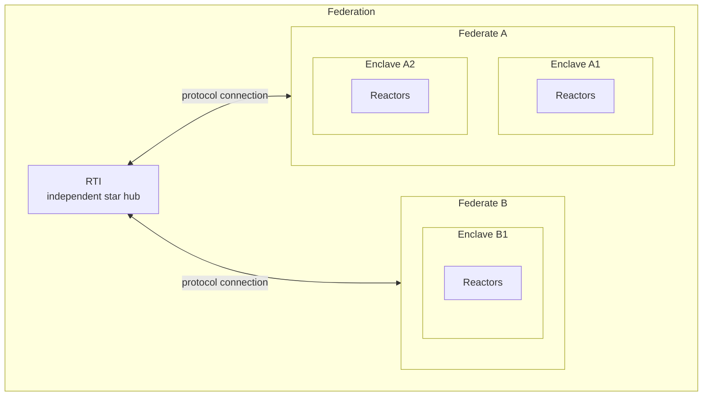
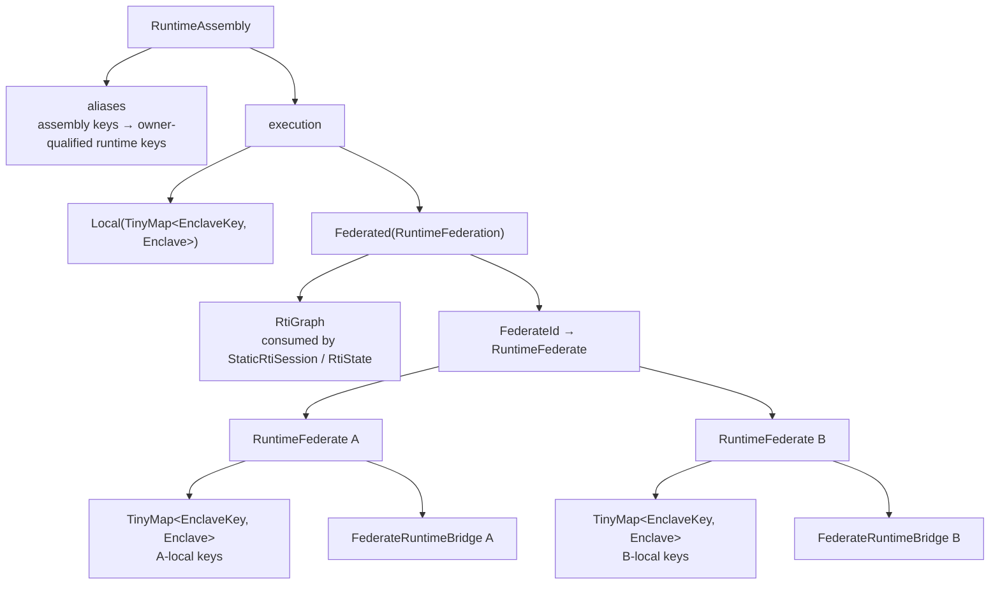

# Federated Runtime Internals

Boomerang separates four runtime concepts. A **Reactor** is an application component. An
**Enclave** is a group of Reactors executed by one scheduler, normally on one thread. A
**Federate** is one deployable compute node or process and owns one or more Enclaves. A
**Federation** is the complete distributed graph. The **RTI** (runtime infrastructure) is an
independent hub that grants logical time and relays messages between Federates.

```mermaid
flowchart LR
    subgraph federation["Federation"]
        direction LR

        subgraph federate_a["Federate A"]
            direction TB

            subgraph enclave_a1["Enclave A1"]
                reactors_a1["Reactors"]
            end

            subgraph enclave_a2["Enclave A2"]
                reactors_a2["Reactors"]
            end
        end

        subgraph federate_b["Federate B"]
            direction TB

            subgraph enclave_b1["Enclave B1"]
                reactors_b1["Reactors"]
            end
        end

        rti["RTI<br/>independent star hub"]
        rti <-->|protocol connection| federate_a
        rti <-->|protocol connection| federate_b
    end
```

These boundaries select the delivery mechanism. A connection inside one Enclave is direct. A
connection between Enclaves owned by the same Federate uses
`InProcessInterPartitionEventSink` and local scheduler channels. Only a connection whose
endpoints belong to different Federates is serialized and represented by an RTI topology edge.

## Build-to-runtime workflow

`boomerang_builder::Assembly` is the mutable declaration graph. The consuming
`Assembly::into_runtime_assembly` pass validates placement, analyzes connection boundaries,
allocates Enclaves, installs local crosslinks, constructs protocol bridges, and returns:

```mermaid
flowchart TB
    runtime_assembly["RuntimeAssembly"]
    aliases["aliases<br/>assembly keys → owner-qualified runtime keys"]
    execution["execution"]
    local["Local(TinyMap&lt;EnclaveKey, Enclave&gt;)"]
    federated["Federated(RuntimeFederation)"]
    rti_graph["RtiGraph<br/>consumed by StaticRtiSession / RtiState"]
    runtime_federates["FederateId → RuntimeFederate"]
    federate_a["RuntimeFederate A"]
    federate_b["RuntimeFederate B"]
    enclaves_a["TinyMap&lt;EnclaveKey, Enclave&gt;<br/>A-local keys"]
    enclaves_b["TinyMap&lt;EnclaveKey, Enclave&gt;<br/>B-local keys"]
    bridge_a["FederateRuntimeBridge A"]
    bridge_b["FederateRuntimeBridge B"]

    runtime_assembly --> aliases
    runtime_assembly --> execution
    execution --> local
    execution --> federated
    federated --> rti_graph
    federated --> runtime_federates
    runtime_federates --> federate_a
    runtime_federates --> federate_b
    federate_a --> enclaves_a
    federate_b --> enclaves_b
    federate_a --> bridge_a
    federate_b --> bridge_b
```

`RuntimeAssembly::into_local` and `RuntimeAssembly::into_federation` are typed conversions. A
local runner cannot accidentally discard federation metadata, and Federate placement remains
structural because every `RuntimeFederate` directly owns its Enclaves.

`RuntimeFederation::into_parts` returns the immutable `RtiGraph` and a deterministic map of
`RuntimeFederate` values. Each Federate contains its own dense Enclave map and protocol bridge. An
`EnclaveKey` is meaningful only within that map, so separate Federates may both own
`EnclaveKey(0)`. The hierarchy contains no RTI thread or task; a deployment launcher or the
single-process static runner consumes the independent Federate values and supplies transports.

`RuntimeFederate` is therefore an owned pre-execution runtime bundle, not lowering metadata or RTI
state. The static runner consumes it into Enclave schedulers and a Federate protocol client. The RTI
is started separately from `RtiGraph` and transport endpoints and never receives a
`RuntimeFederate` value.

The ownership split survives startup. `StaticRtiSession` consumes the graph into `RtiState`, where
immutable identities, dependencies, paths, and routes remain separate from the dense mutable
`RtiRuntimeState`. Each `RuntimeFederate` is consumed independently and its
`FederateRuntimeBridge` supplies only Federate-local routes, mailbox, and fault state to the
protocol client. A client neither receives nor queries the global graph.

## Placement and lowering

`ReactorPlacement::Federate(spec)` opens a Federate scope and starts its initial Enclave. A
descendant declared with `ReactorPlacement::Enclave` starts another scheduler while inheriting
the nearest Federate. Nested Federate scopes, duplicate Federate IDs, and connections with only
one endpoint in a Federate are rejected before execution.

`PartitionAnalysis` records the Federate inherited by every Enclave root and is the authoritative
structural input to builder-owned federation graph analysis. Lowering combines those ownership and
boundary records with assembly-qualified source and target port names, supplied through its
`port_fqn` callback, to derive stable endpoint identities. Graph analysis then validates membership,
endpoint uniqueness, and zero-delay cycles; computes deterministic reachability, affected sets, and
minimum accumulated path delays; and projects the final `RtiGraph` plus Federate-local bridges.
`RtiGraph` mechanically interns those final records and performs no runtime graph analysis.

Same-Federate cross-Enclave boundaries remain local and do not require a payload codec.
Cross-Federate boundaries produce an `EndpointId`, analyzed graph edge, encoder, serialized sender,
inbound decoder, and target action route. No declarative topology manifest crosses into the runtime
phase, and no compatibility constructor can build an RTI from one.

The final `RtiGraph` and aggregate `FederatedRuntimeConnections` value are created during federation
lowering and retained together in builder-private `LoweredFederationRuntime` state. After runtime
actions are lowered, inbound endpoint factories temporarily take and mutate the connections to
attach target Enclave contexts and action references. Finalization consumes that private state and
constructs `RuntimeFederation`, pairing each owned Enclave map with one `FederateRuntimeBridge`
while keeping the immutable graph separate. Enclaves are allocated directly into their owning
Federate's dense map, while owner-qualified aliases pair the `FederateId` with the local
`EnclaveKey`; there is no parallel placement index to validate or retain.

An unowned, reaction-free assembly-root partition may exist transiently while the builder lowers a
federated declaration graph. It is scaffolding rather than executable Federate state and is
discarded before `RuntimeFederation` is constructed. Executable work outside every Federate is
rejected.

## Scheduler and RTI coordination

Every Enclave retains an independent scheduler. After a `RuntimeFederate` is consumed, the static
runner creates one immutable participant layout containing every owned Enclave and one
Federate-wide coordination service. Each scheduler receives a participant proxy implementing the
runtime's generic `LogicalTimeCoordinator`; the service alone owns the single protocol coordinator.

Coordination is split-phase. Before it can block on an in-process upstream barrier, each scheduler
publishes a sequenced `Candidate(tag)`, `Idle`, or `Finished` frontier without waiting for the RTI.
It then preserves the execution order: acquire local barriers, block for the external Federate
permit, process the tag, release downstream barriers, and report external completion. The service
advertises one NET for the minimum finite candidate and releases only acquire requests covered by
the cached RTI grant. All-idle Federates remain responsive without advertising `NET(FOREVER)`.

After a grant covers the current minimum candidate, the service opens a local observation round and
wakes every active participant with the exact tag and epoch. A consumed wake matching that exact
round tag and epoch certifies a subsequent `Idle` publication or a `Candidate` later than the round
tag. Independently, a participant completion at or after the round tag certifies that participant's
progress without a consumed wake. A subsequent frontier transition, or an advancing completion once
any certificate exists, invalidates existing certificates and starts a fresh epoch, so stale state
cannot cause a premature LTC. The participant layout is static for one execution; publications,
request IDs, grants, epochs, certificates, lifecycle, and failure state are dynamic per-run service
state and are never written back into builder analysis, `RtiGraph`, or `RuntimeFederate`.

The RTI remains a star. Each Federate has one protocol identity and connection. Outbound
serialized messages enter that Federate's FIFO mailbox before logical-time completion is
reported. Incoming messages select a stable endpoint route, decode the payload, and schedule the
target action in the correct owned Enclave. Startup begins with identity-only
`FederateToRti::Hello { federate_id }`; trusted clients send no topology or topology hash.

`FederateId` and `EndpointId` remain stable strings at builder, transport,
tracing, error, and protocol boundaries. `RtiGraph` resolves them into
crate-private `FederateKey` and `EndpointKey` values allocated in
lexical stable-ID order. Immutable Federate and endpoint records are owned by
dense maps, while mutable RTI coordination is attached with a dense secondary
map. Grant work sets, dependency paths, route validation, and cached session
participants use those process-local keys; deliveries and diagnostics translate
back to stable IDs. Dense keys are not public API and never appear on the wire.

Scheduler completion is supervised independently of thread join order. The first scheduler error
or panic force-stops every Federate coordination service and closes the RTI session before the
runner joins waiting peers. Panics become `SchedulerThreadPanic`, ordinary scheduler errors remain
`SchedulerRuntime`, and cleanup failures do not replace the first terminal error. Normal shutdown
instead lets the final participant publish `Finished`, sends exactly one Stop per Federate, and
then joins schedulers, services, and the RTI session.

Serialized outbound lowering also retains the already-known target
`FederateId`. Deferred sender construction selects that target's route table and
then its `EndpointId` directly, rather than scanning every Federate's routes.

## Ownership map

- `boomerang_runtime` owns protocol-neutral Enclave types, dense maps, schedulers, local
  crosslinks, generic split-phase coordination concepts, and `InterPartitionEventSink`.
- `boomerang_federated` owns codecs, serialized sinks, endpoint/fault types, protocol clients,
  Federate-wide coordination services, `FederateRuntimeBridge`, `RuntimeFederate`,
  `RuntimeFederation`, RTI state, sessions, and transports.
- `boomerang_builder` owns declarations, placement and federation graph analysis, graph projection,
  codec registration, pending bindings, and the `RuntimeAssembly` lowering result.
- `boomerang` exposes application-facing execution functions that consume `RuntimeFederation`.

The dependency direction is `boomerang_builder → boomerang_federated → boomerang_runtime` for
runtime integration. `boomerang_runtime` has no federation feature and no protocol dependency.

## Behavioral proof

`boomerang/tests/federated_static.rs` builds Federate A with a source Enclave and a relay Enclave,
plus Federate B with a sink Enclave. Source-to-relay stays in process; relay-to-sink is the only
lowered RTI endpoint. The same graph runs through the in-memory and TCP runners and records the
value at the expected complete logical tag.

The builder, runtime, and federated crate tests additionally cover duplicate and nested Federate
declarations, codec failures, delayed connections, fanout, cycles, route validation, independent
dense key spaces, split-phase publication ordering, observation-epoch invalidation, exact protocol
frame counts, Federate-owned runtime stores, and stop-before-join failure supervision.
