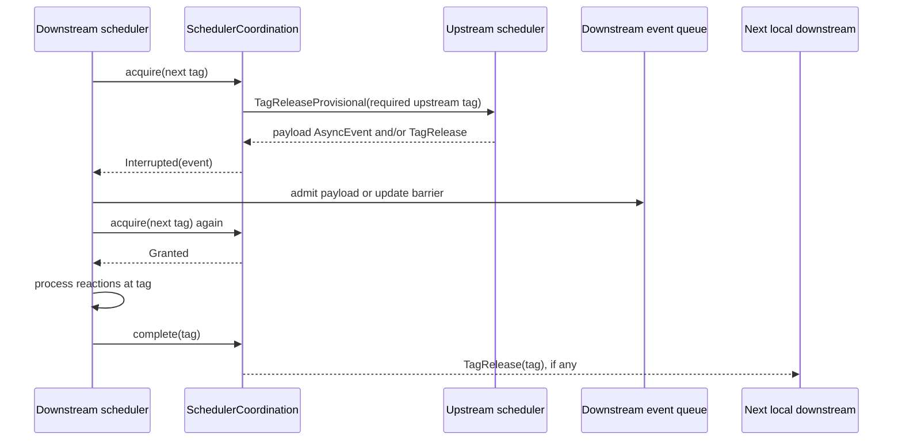
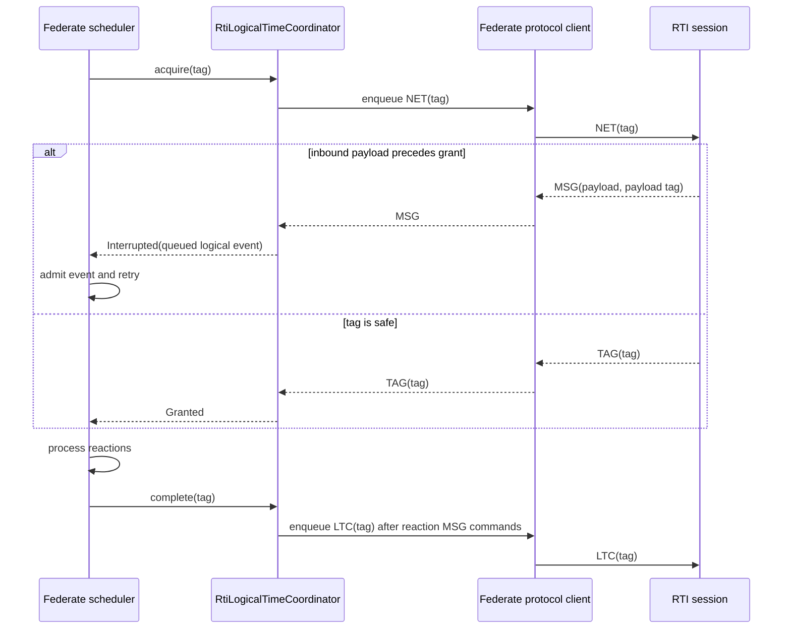

# Scheduler Internals

This document explains the protocol-free scheduler machinery shared by local
enclaves and federated execution. It is maintainer documentation. Application
authors should use the guides in `book/src` instead.

The central invariant is simple: a scheduler may process a logical tag only
after every local upstream enclave and its optional external logical-time
coordinator permit that tag. Once reactions finish, the scheduler releases its
local downstream enclaves before reporting completion externally. The runtime
uses one lifecycle for those steps while keeping the local shared-memory and
distributed RTI algorithms separate.

## Ownership and File Map

`boomerang_runtime/src/sched/mod.rs` owns `Scheduler`, startup, the `try_next`
loop, reaction execution, wall-clock synchronization, and shutdown.
`boomerang_runtime/src/sched/queue.rs` owns the tag-ordered root event queue.
`boomerang_runtime/src/sched/modal.rs` wraps that queue with mode-local event
queues and mode lifecycle state as `EventManager`.

`boomerang_runtime/src/sched/barrier.rs` owns local `LogicalTimeBarrier` state,
the protocol-free `LogicalTimeCoordinator` trait, and the private
`SchedulerCoordination` composition object. `boomerang_runtime/src/event.rs`
defines scheduled events and `AsyncEvent`, the messages that wake a scheduler
from another thread or partition.

`boomerang_runtime/src/reaction.rs` owns generated connection reactions.
`InterPartitionSenderReactionFn` calculates delivery timing once and delegates
to an `InterPartitionEventSink`. The in-process sink remains in the default
runtime. The serialized sink is feature-gated but still knows only runtime
encoder and outbound-sink interfaces, not RTI or wire types.

`boomerang_builder/src/connection.rs` chooses the sink while lowering a
connection. `boomerang_builder/src/assembly/build.rs` derives local crosslinks
and serialized federation artifacts from one `InterPartitionPlan`.
`boomerang_federated/src/client.rs` implements the external contract as
`RtiLogicalTimeCoordinator`; protocol sessions and transports remain in
`boomerang_federated`.

## Scheduler Construction

An `Enclave` contains resolved runtime objects, the immutable reaction graph,
an asynchronous event channel, local upstream and downstream references, and a
shutdown channel. `Scheduler::new` consumes these parts. It builds reaction
contexts and the store, computes reaction-set limits, initializes
`EventManager`, converts every upstream reference into a `LogicalTimeBarrier`,
and gives all local barriers and downstream send contexts to
`SchedulerCoordination`.

The local constructor installs `NoopLogicalTimeCoordinator`. Code that owns an
external authority calls `Scheduler::new_with_logical_time_coordinator`, which
replaces the no-op implementation. The scheduler does not learn whether that
authority is an RTI, a replay controller, or a future backend.

Static graph work must happen before construction. Reaction levels, modal
indexes, local crosslinks, route handlers, and federated topology indexes are
lowering artifacts. The scheduler consumes them and does not call back into the
builder.

## Startup

`Scheduler::startup` inserts every startup action at its precomputed tag,
normally `Tag::ZERO`. A configured timeout becomes a terminal shutdown event.
The scheduler sets its current tag to the predecessor of zero and publishes
that initial progress to local downstream enclaves. Finally it resets the
physical start instant used by wall-clock and physical-action calculations.

Startup work matters for externally driven enclaves. A scheduler without a
queued event, a configured timeout, or keep-alive behavior may select its
ordinary empty-queue shutdown before another thread admits an inbound event.
Federated fixtures that wait only for remote input therefore schedule a bounded
startup shutdown; a real input may replace it with an earlier shutdown.

## The `try_next` State Machine

Each `try_next` call performs one scheduler step:

1. Drain immediately available `AsyncEvent` values and offer each one to
   scheduler coordination before ordinary event handling.
2. Peek the earliest logical tag in `EventManager`.
3. Acquire that tag through `SchedulerCoordination`. An interruption is handled
   and returns control to the outer loop without processing the ungranted tag.
4. When fast-forwarding is disabled, wait until the tag's wall-clock instant.
   An asynchronous event can interrupt this wait and restart the loop.
5. Pop and merge all queued root events at the selected tag, then run enabled
   reactions in dependency-level order.
6. Update the current tag and complete coordination. Local downstream releases
   are emitted before external completion.
7. Stop after a terminal event. Otherwise return to the loop.

If no logical event is queued, the scheduler waits only when a shutdown tag or
keep-alive policy requires it. An admitted asynchronous event re-enters normal
handling. Otherwise the scheduler creates its ordinary next-microstep shutdown
event.

The hot path contains one coordination acquire and one coordination completion
call. Backend-specific branches do not belong in `try_next`.

## Event Management and Reaction Levels

Tags consist of a logical time offset and a microstep. `EventQueue` reverses
`BinaryHeap` ordering so the smallest tag is selected first. Events with the
same tag are merged, including their reaction sets. At an equal tag, ordinary
work is selected before a terminal event; merging retains the terminal flag so
shutdown happens only after all work at that tag.

`EventManager` adds mode-local queues and activation history around the root
queue. It presents the same peek, pop, insert, shutdown, and reaction-set
recycling operations to `Scheduler`. Mode transitions may rebase retained
action values between local and global tags, using the indexes compiled during
lowering.

`Scheduler::process_tag` walks reactions by increasing dependency level.
Reactions at one level are statically independent and may run through the
parallel feature. Port effects extend only later levels at that tag. Scheduled
actions create future tagged events. The scheduler retains the earliest
shutdown requested by reactions, applies mode transitions after ordinary
reaction work, and resets ports at the end of the tag.

## Asynchronous Data and Coordination Events

`AsyncEvent::Logical` contains a complete tag, target action key, and typed
value. It stores the action value and schedules the target action's dependent
reactions. `AsyncEvent::Physical` contains a wall-clock instant; the receiving
scheduler maps that instant to a logical tag using its own start time.
`AsyncEvent::Shutdown` requests shutdown relative to the current tag.

`AsyncEvent::TagRelease` advances a local upstream barrier and is fully
consumed by `SchedulerCoordination`. `TagReleaseProvisional` represents a
downstream request for upstream progress. In a local cycle it may also update a
barrier before the scheduler treats it as an empty future event. Coordination
events never enter the ordinary action store.

Logical events at or behind the current tag are rejected by ordinary handling.
An external backend must therefore admit an inbound payload and return its
queued interruption before allowing the scheduler to consume a later grant.

## Local Enclave Barriers and Provisional Releases

Each local downstream enclave has one `LogicalTimeBarrier` per upstream
enclave. A barrier tracks the greatest released upstream tag and the greatest
provisional request still outstanding. For a delayed edge, acquisition asks
for the latest upstream tag that could produce the requested downstream tag;
for an undelayed edge it asks for the downstream tag itself.

If the required upstream tag is already released, acquisition succeeds. If
not, the barrier sends one `TagReleaseProvisional` request through the upstream
send context and blocks for an asynchronous event. An unchanged or weaker
retry reuses the outstanding watermark. An actual sufficient release retires
it. This suppression avoids duplicate requests without weakening a stronger
pending request.

The interruption may be a release, payload, shutdown request, or another local
coordination event. The scheduler handles it and retries from the top instead
of assuming that any wake-up grants the tag. This is also why local acquisition
can prevent the external coordinator from being called.

Local zero-delay cycles retain this provisional-release mechanism. It is a
shared-memory protocol and must not be inferred to exist in distributed
federation.

## The External Logical-Time Coordinator Contract

`LogicalTimeCoordinator` is synchronous and protocol-free. `acquire` receives
the requested complete tag and the scheduler's asynchronous event receiver. It
returns `Granted`, returns `Interrupted(event)`, or fails terminally with
`CoordinationError`. `complete` reports that every enabled reaction at the tag
has finished.

The scheduler calls the external `acquire` only after every local upstream
barrier grants the tag. It calls external `complete` only after reaction
processing and local downstream release. Implementations must preserve an
inbound event for scheduler handling when returning `Interrupted`; they must
not consume a later grant while an earlier payload still requires admission.

The contract does not prescribe a grant algorithm. The RTI adapter uses LF
`NET`, `TAG`, `MSG`, and `LTC` semantics and an in-transit tag set. A replay or
other authority may use different evidence while obeying the same lifecycle.

## Acquire, Process, Complete Ordering

The exact order for one granted logical tag is:

    acquire every local upstream barrier
    acquire the external coordinator
    optionally synchronize to wall clock
    process all enabled reactions at the tag
    release every local downstream enclave
    complete the external coordinator

This order is causal, not cosmetic. Local acquisition can reveal an event that
must be admitted before an external request. Reaction-emitted serialized
messages must enter their FIFO outbound queue before the RTI adapter emits
`LTC`. Local downstream schedulers must see completed local work before an
external authority observes completion.

## Cross-Partition Payload Delivery

Lowering generates a source bridge reaction and a target action/receiver
reaction for every inter-partition connection. The source path is common:

    source output port
        -> InterPartitionSenderReactionFn
        -> InterPartitionEventSink

The reaction extracts the typed value, skips an empty port, identifies logical
or physical delivery, and calculates the complete logical tag once. A zero
minimum delay preserves the current tag. A positive delay advances logical
time and resets the microstep. Same-timestamp microstep values are preserved
when the source itself produces at such a tag.

`InProcessInterPartitionEventSink` clones the typed value into the target
scheduler's asynchronous queue. `SerializedInterPartitionEventSink` encodes
the value and emits a protocol-free outbound command. Federation then converts
that command to `MSG`, routes it through the RTI, and uses the target route's
attached `FederatedInboundEndpoint` to decode and schedule the same logical
action. Both paths converge on `ConnectionReceiverReactionFn`, which writes the
target input port.

Backend sinks own dispatch and error policy. The common reaction must not grow
transport, RTI, Tokio, codec-registration, or builder-key knowledge.

## Logical and Physical Time

Logical delivery uses a complete `Tag`; deterministic ordering includes its
microstep. In-process physical delivery remains supported and schedules from a
wall-clock instant with an optional delay. Serialized physical delivery is not
implemented, and builder validation rejects physical cross-federate
connections before runtime construction.

Fast-forward execution skips wall-clock synchronization but does not change
logical tags or coordination ordering. The static federated runner currently
requires fast-forward because it has no common physical start. Do not claim
physical-time federation equivalence until common-start and clock-bound
semantics are designed and tested.

## Shutdown and Error Propagation

A terminal event closes the scheduler shutdown channel before terminal
reactions run. The scheduler still processes all merged work at that tag,
updates its current tag, releases local downstream enclaves, and reports
external completion. It then exits the loop and reports elapsed logical and
physical time.

Local send failures are warnings unless they contradict expected lifecycle.
Coordination failures are typed `RuntimeError::Coordination` values and stop the
fallible event loop. The federated serialized sink records the first codec or
outbound failure in source-local fault state; the RTI coordinator observes that
state and returns it rather than allowing later progress.

Federated no-future shutdown sends `NET(FOREVER)` before `Stop`. The RTI uses
that evidence to reconsider downstream grants. Ordered payload admission and
the shared outbound mailbox ensure reaction-emitted `MSG` commands precede the
completion or stop frames that depend on them.

## Supported and Unsupported Cycle Semantics

Local enclave cycles may use provisional release to establish progress.
Federated positive-delay cycles are supported because the static topology has
a strictly advancing path. Distributed zero-delay cycles are rejected during
builder validation. The current protocol deliberately has neither provisional
tag grants (`PTAG`) nor per-port absence messages (`ABS`), so a common trait
name cannot make those semantics safe.

Keep this distinction visible in tests and diagnostics. Never weaken the
distributed rejection merely because a local topology with the same shape
executes successfully.

## Tests That Define Behavior

`boomerang_runtime/src/sched/mod.rs` proves local-before-external acquisition,
local-before-external completion, interruption short-circuiting, default
no-external execution, and acquire/completion failure propagation.
`boomerang_runtime/src/sched/barrier.rs` protects provisional request
suppression and monotonic release state.

`boomerang_runtime/src/reaction.rs` proves identical local and serialized
logical tag/value calculation for zero and positive delay and retains the
physical-local versus serialized rejection boundary.
`boomerang_builder/src/tests/federated.rs` proves exact local crosslink and
serialized route projections, distributed-cycle rejection, protocol behavior,
and local-versus-in-memory-federated value/tag/shutdown equivalence.

`boomerang_federated/src/client.rs`, `rti/`, and `session.rs` protect ordered
`MSG` admission before later `TAG` consumption, LF-aligned grant evidence,
in-transit tag clearing through `LTC`, deterministic reevaluation, and terminal
fault behavior. `boomerang/tests/federated_static.rs` is the public facade
proof. Ignored localhost TCP tests supplement these deterministic in-memory and
pure-state tests; they do not replace them.

## Adding a Partition Backend

Before adding another backend, verify all of the following:

- Keep its scheduler-facing types protocol-free and implement
  `LogicalTimeCoordinator` only if it is an external logical-time authority.
- Define what evidence grants a complete tag and how inbound events interrupt
  acquisition before a later grant is consumed.
- Preserve local-acquire, external-acquire, process, local-release, and
  external-complete ordering.
- Implement only dispatch and error policy in an `InterPartitionEventSink`;
  reuse the common sender's port extraction and tag calculation.
- Lower all static routes, handlers, identities, and topology indexes before
  scheduler construction. Do not call the builder during execution.
- State logical, physical, cycle, shutdown, and failure semantics explicitly.
- Add characterization and local-equivalence tests before replacing an
  existing path, including complete tags and shutdown behavior.
- Keep transport and async-runtime dependencies outside `boomerang_runtime`.
