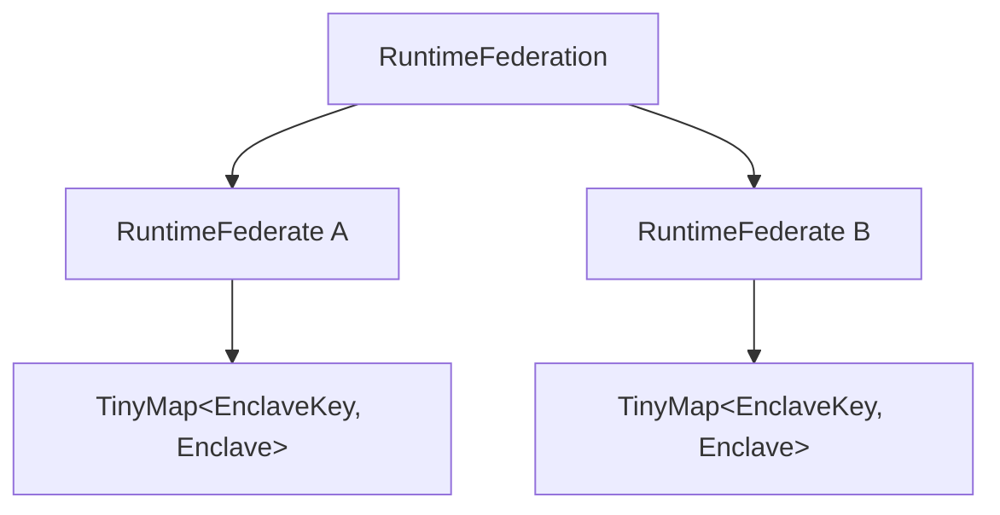

# Federate-Local Enclave Ownership Implementation Plan

> **For agentic workers:** REQUIRED SUB-SKILL: Use superpowers:subagent-driven-development (recommended) or superpowers:executing-plans to implement this plan task-by-task. Steps use checkbox (`- [ ]`) syntax for tracking.

**Goal:** Make every `RuntimeFederate` own an independent dense Enclave store with Federate-local `EnclaveKey` values.

**Architecture:** Assembly lowering resolves every runtime object through a composite `RuntimeEnclaveRef`, allocates executable federated Enclaves directly into their owning Federate's `TinyMap`, and retains any reaction-free assembly-root partition only as transient lowering scaffolding. `RuntimeFederation` contains topology and Federates, while the static runner consumes each Federate's store independently and returns results nested by `FederateId`.

**Tech Stack:** Rust, `tinymap`, `slotmap`, Cargo feature configurations, existing builder/runtime/federated integration tests.

---

### Task 1: Introduce owner-qualified runtime Enclave aliases

**Files:**
- Modify: `boomerang_builder/src/assembly/build.rs:28-215`
- Modify: `boomerang_builder/src/assembly/debug.rs:265-325`
- Modify: `boomerang_builder/src/tests/mod.rs:240-340`
- Modify: `boomerang/benches/physical_actions.rs:55-70`

- [ ] **Step 1: Add a compile-time ownership assertion for local aliases**

In the existing modal runtime lowering test in `boomerang_builder/src/tests/mod.rs`, import
`RuntimeEnclaveRef` and assert that the Reactor alias identifies the local owner:

```rust
let (owner, runtime_reactor) =
    runtime_assembly.aliases.reactor_aliases[reactor_key].clone();
assert!(matches!(owner, RuntimeEnclaveRef::Local(_)));
assert_eq!(
    owner,
    runtime_assembly.aliases.enclave_aliases[reactor_key].clone()
);
```

- [ ] **Step 2: Run the focused compile check and confirm RED**

Run: `cargo check -p boomerang_builder --tests`

Expected: compilation fails because `RuntimeEnclaveRef` does not exist and alias values still use
bare `EnclaveKey` values.

- [ ] **Step 3: Add the owner-qualified reference and local store accessors**

Add the documented public identity type in `assembly/build.rs`:

```rust
#[derive(Debug, Clone, PartialEq, Eq)]
pub enum RuntimeEnclaveRef {
    /// Enclave owned by the single-process local runtime.
    Local(runtime::EnclaveKey),
    /// Enclave owned by one protocol Federate.
    #[cfg(feature = "federated")]
    Federated {
        /// Protocol identity of the owning Federate.
        federate: boomerang_federated::FederateId,
        /// Dense key within the owning Federate's Enclave map.
        enclave: runtime::EnclaveKey,
    },
}
```

Change `RuntimeAliases::enclave_aliases` to store `RuntimeEnclaveRef`, and change the first tuple
element in Reactor, Reaction, Mode, Action, and Port aliases to `RuntimeEnclaveRef`. Add a private
`RuntimeEnclaveStores` owner with a local `TinyMap` and feature-gated Federate maps, plus these
operations:

```rust
fn get(&self, owner: &RuntimeEnclaveRef) -> Option<&runtime::Enclave>;
fn get_mut(&mut self, owner: &RuntimeEnclaveRef) -> Option<&mut runtime::Enclave>;
fn local_mut(&mut self) -> &mut tinymap::TinyMap<runtime::EnclaveKey, runtime::Enclave>;
```

Use `RuntimeEnclaveRef::Local` while allocating the non-federated map. Replace direct
`runtime_assembly.enclaves[key]` access throughout lowering with context helpers that resolve a
borrowed `RuntimeEnclaveRef`. Clone owner references when inserting aliases; retain object-local
keys unchanged.

- [ ] **Step 4: Update local consumers and debug formatting**

Update `RuntimeAliases::fmt`, local builder tests, and the physical-actions benchmark to destructure
or display `RuntimeEnclaveRef`. Keep `RuntimeAssembly::local_enclaves` and `into_local` returning the
existing dense local `TinyMap`.

- [ ] **Step 5: Run the local compile check and confirm GREEN**

Run: `cargo check -p boomerang_builder --tests`

Expected: exit 0.

- [ ] **Step 6: Commit the alias ownership change**

```bash
git add boomerang_builder/src/assembly/build.rs boomerang_builder/src/assembly/debug.rs \
  boomerang_builder/src/tests/mod.rs boomerang/benches/physical_actions.rs
git commit -m "refactor(builder): qualify runtime enclave aliases"
```

### Task 2: Allocate Enclaves directly into Federate-owned maps

**Files:**
- Modify: `boomerang_builder/src/assembly/build.rs:156-250,650-1140`
- Modify: `boomerang_builder/src/federated/bindings.rs:1-75`
- Modify: `boomerang_builder/src/tests/federated.rs:833-930,1250-1340`
- Modify: `boomerang_federated/src/hierarchy.rs:1-180`
- Modify: `boomerang_federated/src/static_runner.rs:25-145`
- Modify: `boomerang/tests/federated_static.rs:160-205`

- [ ] **Step 1: Replace the federation-wide ownership test with the desired API**

Rename `public_api_owns_dense_runtime_enclave_map` to
`public_api_federates_own_local_enclave_maps` and assert independent dense key spaces:

```rust
let (topology, federates) = federation.into_parts();
assert_eq!(topology.topology().edges.len(), 1);

let a = &federates[&FederateId::new("a")];
let b = &federates[&FederateId::new("b")];
assert_eq!(a.enclaves().len(), 2);
assert_eq!(b.enclaves().len(), 1);
assert_eq!(a.enclaves().keys().next(), b.enclaves().keys().next());
```

Add a builder assertion showing that source and sink aliases use distinct Federate owners even
when their local Enclave keys are equal:

```rust
let source_owner = parts.aliases.port_aliases[AssemblyPortKey::from(source)].0.clone();
let sink_owner = parts.aliases.port_aliases[AssemblyPortKey::from(sink)].0.clone();
assert!(matches!(&source_owner, RuntimeEnclaveRef::Federated { federate, .. }
    if federate.as_str() == "source"));
assert!(matches!(&sink_owner, RuntimeEnclaveRef::Federated { federate, .. }
    if federate.as_str() == "sink"));
assert_eq!(source_owner.enclave_key(), sink_owner.enclave_key());
```

Expose a documented `RuntimeEnclaveRef::enclave_key` accessor returning the owner-local key.

- [ ] **Step 2: Run the federated compile check and confirm RED**

Run: `cargo check -p boomerang --features federated --tests`

Expected: compilation fails because `RuntimeFederate::enclaves` and the two-part federation
`into_parts` API do not exist.

- [ ] **Step 3: Allocate each federated partition into its final owner**

During `initialize_runtime_assembly_context`, use
`PartitionAnalysis::federate_for_partition` for each distinct partition root. Allocate owned
partitions with:

```rust
let federate = boomerang_federated::FederateId::new(federate_id);
let enclaves = stores.federates.entry(federate.clone()).or_default();
let enclave = enclaves.insert(runtime::Enclave::with_event_q_size(queue_size));
RuntimeEnclaveRef::Federated { federate, enclave }
```

Allocate an unowned assembly-root partition into the transient local map. Before federated
finalization, reject that map if any Enclave contains reactions; otherwise discard it as
non-executable assembly scaffolding. Crosslink `local_boundaries()` only after resolving both
references to the same local map or the same Federate map; return `AssemblyError::InternalError`
when a supposedly local edge has different owners.

Delete `lower_federate_enclaves`; ownership is already represented by
`BTreeMap<FederateId, TinyMap<EnclaveKey, Enclave>>`.

- [ ] **Step 4: Move dense ownership into `RuntimeFederate`**

Change the hierarchy to:

```rust
pub struct RuntimeFederate {
    /// Protocol identity for this Federate.
    id: FederateId,
    /// Dense runtime Enclaves owned by this Federate.
    enclaves: tinymap::TinyMap<boomerang_runtime::EnclaveKey, boomerang_runtime::Enclave>,
    /// Protocol bridge serving this Federate.
    bridge: FederateRuntimeBridge,
}

pub struct RuntimeFederation {
    /// Immutable topology used to start the RTI.
    topology: CompiledTopology,
    /// Runtime Federates keyed by protocol identity.
    federates: BTreeMap<FederateId, RuntimeFederate>,
}
```

Add documented `RuntimeFederate::enclaves`, `enclaves_mut`, and `into_parts` methods. Remove
`enclave_keys`, federation-wide `enclaves`, and their accessors. Make
`RuntimeFederation::into_parts` return `(CompiledTopology, BTreeMap<FederateId, RuntimeFederate>)`.

Change `RuntimeFederation::from_lowered` to accept the Federate maps and bridges. For each topology
Federate, remove its map and bridge, reject an empty map with `EmptyRuntime(FederateId)`, and build
one `RuntimeFederate`. Retain `MissingRuntime`, `MissingBridge`, and `UnknownFederate`; remove the
three Enclave placement variants.

- [ ] **Step 5: Simplify transient static federation state**

Remove `FederateEnclaveMap` and `FederatePlacementError`. `StaticFederationRuntime` keeps topology
and connections only. Its `finalize` accepts
`BTreeMap<FederateId, TinyMap<EnclaveKey, Enclave>>` and calls the new `from_lowered` constructor.
Update builder initialization and federated endpoint binding to resolve owner-qualified aliases.

- [ ] **Step 6: Run the federated compile check and confirm GREEN**

Run: `cargo check -p boomerang --features federated --tests`

Expected: exit 0.

- [ ] **Step 7: Commit Federate-owned Enclave maps**

```bash
git add boomerang_builder/src/assembly/build.rs boomerang_builder/src/federated/bindings.rs \
  boomerang_builder/src/tests/federated.rs boomerang_federated/src/hierarchy.rs \
  boomerang_federated/src/static_runner.rs boomerang/tests/federated_static.rs
git commit -m "refactor(federated): localize enclave ownership"
```

### Task 3: Make the static runner preserve Federate-local identities

**Files:**
- Modify: `boomerang_federated/src/static_runner.rs:245-920`
- Modify: `boomerang_federated/src/static_runner.rs:900-1080`
- Modify: `boomerang_builder/src/tests/federated.rs:1-65,560-830`
- Modify: `boomerang/tests/federated_static.rs:100-240`
- Modify: `boomerang/src/static_federation.rs:1-30`

- [ ] **Step 1: Add nested-result compile assertions**

After running the public in-memory federation, assert that results are grouped by Federate:

```rust
let a_envs = &envs[&FederateId::new("a")];
let b_envs = &envs[&FederateId::new("b")];
assert_eq!(a_envs.keys().next(), b_envs.keys().next());
```

Update builder test helpers to look up returned `Env` values through the expected `FederateId`
before using the local `EnclaveKey`.

- [ ] **Step 2: Run the static-runner compile check and confirm RED**

Run: `cargo check -p boomerang_federated --features runtime,serde-json-codec --tests`

Expected: compilation fails because `FederationEnvs` is still a flat `TinySecondaryMap`.

- [ ] **Step 3: Consume Federates without rebuilding placement**

Change the result type to:

```rust
pub type FederationEnvs = BTreeMap<
    FederateId,
    tinymap::TinySecondaryMap<boomerang_runtime::EnclaveKey, boomerang_runtime::Env>,
>;
```

Make `PreparedStaticFederation` hold the topology and
`BTreeMap<FederateId, TinyMap<EnclaveKey, Enclave>>`. In `prepare_static_federation`, consume each
`RuntimeFederate` into `(id, enclaves, bridge)`, validate the map key against the owned ID, and
place the map and bridge under that ID.

In execution, determine one gateway key per Federate from that Federate's own map. Iterate
`(federate_id, enclaves)` and then `(enclave_key, enclave)`, passing both identities through thread
results. Collect returned environments into `envs.entry(federate_id).or_default()`.

Remove all reverse-placement lookups, duplicate-placement validation, flattening, and assumptions
that `EnclaveKey` is unique across Federates.

- [ ] **Step 4: Run the static-runner compile check and confirm GREEN**

Run: `cargo check -p boomerang_federated --features runtime,serde-json-codec --tests`

Expected: exit 0.

- [ ] **Step 5: Commit nested runner ownership**

```bash
git add boomerang_federated/src/static_runner.rs boomerang_builder/src/tests/federated.rs \
  boomerang/tests/federated_static.rs boomerang/src/static_federation.rs
git commit -m "refactor(federated): preserve federate-local enclave keys"
```

### Task 4: Update documentation and feature consumers

**Files:**
- Modify: `docs/federated-runtime.md`
- Modify: `docs/superpowers/specs/2026-07-17-federate-local-enclave-ownership-design.md`
- Modify: `boomerang_builder/src/assembly/debug.rs`
- Modify: any remaining Rust consumers reported by the search command below

- [ ] **Step 1: Find stale global-ownership terminology and APIs**

Run:

```bash
rg -n "federation-wide|every runtime Enclave|enclave_keys|FederateEnclaveMap|FederatePlacementError|RuntimeFederation::enclaves|\.enclaves\(\)" \
  --glob '*.rs' --glob '*.md' boomerang boomerang_builder boomerang_federated boomerang_util docs
```

Expected: only locations requiring conversion or historical text in the superseded design remain.

- [ ] **Step 2: Update the runtime hierarchy documentation**

Change the Mermaid ownership diagram and prose in `docs/federated-runtime.md` to show:



State explicitly that `EnclaveKey` is Federate-local and that cross-Federate communication uses
protocol endpoint identities rather than foreign Enclave keys. Add a short clarification to the
design spec that reaction-free unowned assembly scaffolding is transient and excluded from the
runtime hierarchy.

- [ ] **Step 3: Run all-feature compile checks**

Run: `cargo check --workspace --all-features --all-targets`

Expected: exit 0 with no warnings introduced by the refactor.

- [ ] **Step 4: Commit documentation and remaining consumers**

```bash
git add docs/federated-runtime.md \
  docs/superpowers/specs/2026-07-17-federate-local-enclave-ownership-design.md \
  boomerang boomerang_builder boomerang_federated boomerang_util
git commit -m "docs: describe federate-local enclave ownership"
```

### Task 5: Final verification

**Files:**
- Modify only files requiring formatting or fixes exposed by verification.

- [ ] **Step 1: Format and verify the diff**

Run: `cargo fmt --all -- --check`

Expected: exit 0. If formatting differs, run `cargo fmt --all`, inspect the changes, and rerun the
check.

Run: `git diff --check`

Expected: exit 0.

- [ ] **Step 2: Run the full workspace test suite once**

Run: `cargo test --workspace --all-features`

Expected: every workspace test passes with zero failures.

- [ ] **Step 3: Inspect the ownership-focused diff**

Run:

```bash
git diff --stat HEAD~4..HEAD
git status --short
```

Expected: tracked files are clean; unrelated untracked `.agent/`, `docs/execplans/`, `lcov.info`,
and `logs/` remain untouched.

- [ ] **Step 4: Commit verification-only fixes if needed**

If verification required source changes:

```bash
git add boomerang/benches/physical_actions.rs boomerang/src/static_federation.rs \
  boomerang/tests/federated_static.rs boomerang_builder/src/assembly/build.rs \
  boomerang_builder/src/assembly/debug.rs boomerang_builder/src/federated/bindings.rs \
  boomerang_builder/src/tests/federated.rs boomerang_builder/src/tests/mod.rs \
  boomerang_federated/src/hierarchy.rs boomerang_federated/src/static_runner.rs \
  docs/federated-runtime.md \
  docs/superpowers/specs/2026-07-17-federate-local-enclave-ownership-design.md
git commit -m "fix: complete federate-local enclave ownership"
```

If no source changes were needed, do not create an empty commit.
